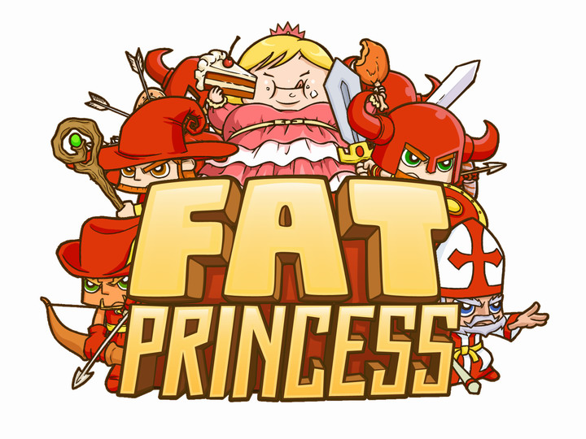

Fat Princess is a colourful tactical capture-the-flag game where you rescue your princess while feeding the enemy's princess cake to make her harder to carry back. It sounds ridiculous and it is, in the best way.

I own it on both PS3 and PSP. The PS3 version looks better on a larger screen, but the PSP version — Fat Princess: Fistful of Cake — actually has more story content, which the PS3 release is missing. For local multiplayer the PSP is great; for online the PS3 is where it shines.

Online is genuinely where the game comes alive. Playing against real people raises the difficulty and unpredictability in a way the single-player campaign can't match. Coordinating with teammates to hold the enemy off while your own party carries the princess back is a lot of fun when everyone's playing properly.

Two bugs worth mentioning: a storytelling glitch on first playthrough that fixed itself after a restart, and a movement freeze in my first online session that was resolved by rejoining. Neither was a big deal, just worth knowing.

A solid addition to any PS3 library if you want something colourful and chaotic to play with friends.
