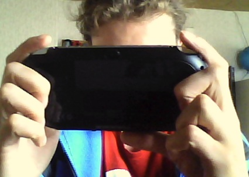
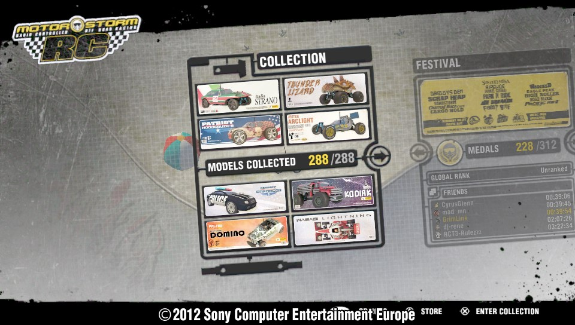
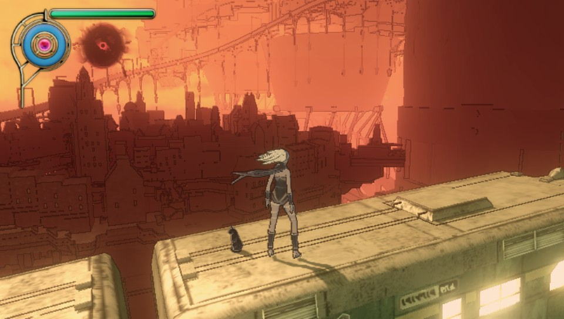
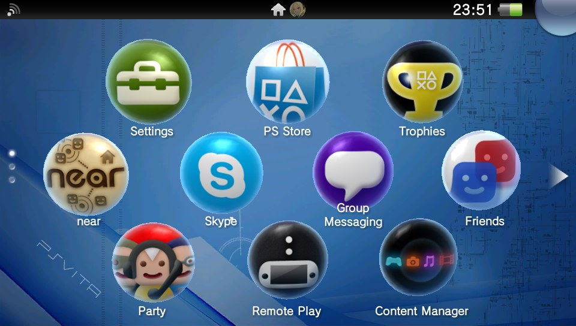
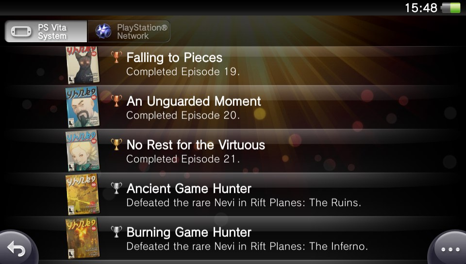

It's finally mine. First thing I did was fire up MotorStorm RC — great game, but I immediately knew I needed more. The hardware was making promises the launch library hadn't quite caught up to yet.

After a month with it I can share some proper thoughts.

## The screen

The OLED display is the first thing everyone notices and it earns every bit of the attention. MotorStorm RC is a great example — it genuinely looks better on the Vita's smaller screen than the PS3 version does on an HD TV. Colours are vivid, everything is sharp, and at 960×544 you can see details that would be easy to miss on a larger panel. It's the kind of screen that makes everything look like it was made for it.

## Controls

The front and back touch panels add a new dimension to a lot of games, and the motion controls are a nice addition. It's one of those things you can't fully appreciate until you feel it — Welcome Park ships free on every Vita and shows off everything in a hands-on way that a written description never could. Holding it did take a bit of adjustment — the grip is different from a DualShock — but after a few sessions it felt completely natural.

## Camera

There's a front and back camera plus a Photo app, and they work fine for quick snapshots. The quality is decent. The limitation is that the app gives you almost no control — no lighting adjustment, no focus settings. The gallery is also fairly basic. The one standout feature is the built-in screenshot function, which lets you capture anything happening on screen and share it instantly. That alone I've used constantly.

## Sound and battery

The speakers are okay but not the Vita's strong suit — for anything you want to actually feel, a headset makes a real difference. Battery life is shorter than I'd like, but given how much the hardware is doing it makes sense. The OLED panel is actually more efficient than most screens on phones and other portables, so at least it's not the battery's biggest drain.

## PSN

This is where it all comes together. Everything I had on PS3 — the trophy system, messaging, game purchases from the store, finding friends — is right there on a device I can carry anywhere. It's what I always wanted from the PSP but never had. The Vita is locked to one PSN account, which I know frustrates some people, but personally I think that's the right call for a device built around one player's experience.

A month in and I'm completely in love with it. PS3-level gaming on the go, a screen that makes everything look incredible, and full PSN in my pocket. Now I just need more games.
