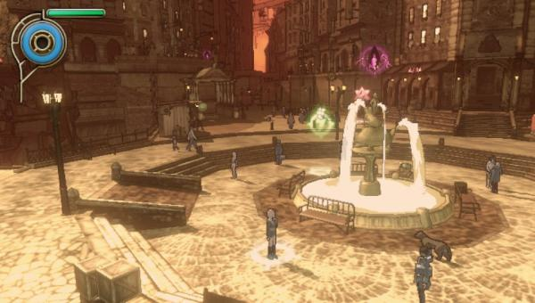
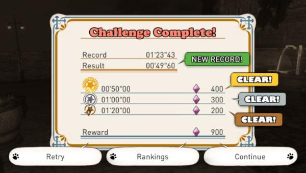
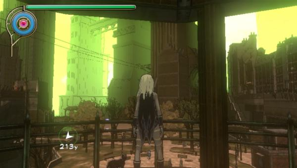
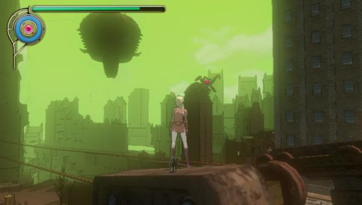
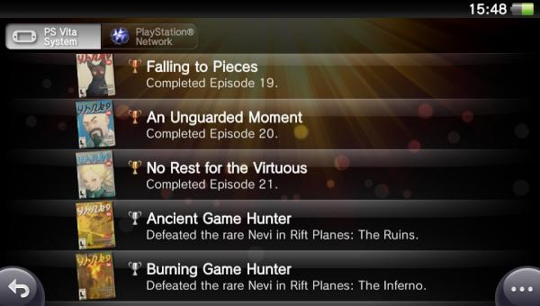
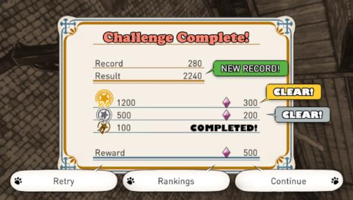
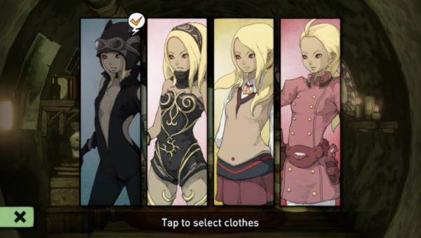
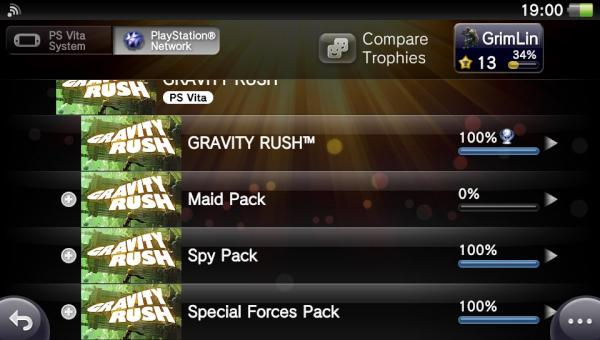
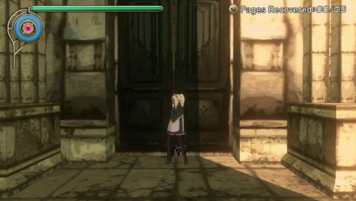
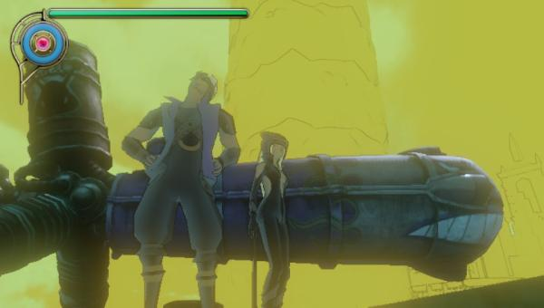

**June 14, 2012 —** Played the first 2 chapters plus some random exploring — super fun!

**June 15, 2012 —** Last night playing was really fun, beat a time challenge in one try.

**June 17, 2012 —** Just arrived at the 4th and biggest city.

The Military Mission Pack is a great add-on and I got it for free for picking up Gravity Rush in the first week. Battle stations!

Finished the story — what a really nice experience. And apparently, it's easy?

**June 27, 2012 —** Played the first chapter of the Spy Pack — new costume for Kat, yeah!

**June 30, 2012 —** Spy Pack 100% — nice add-on, although it didn't add that much to the story.

**July 11, 2012 —** Playing the new Maid Pack DLC.

**July 12, 2012 —** YES! 100% on Gravity Rush! It's been a great journey — the best game I've played so far on the PS Vita.

