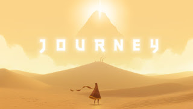
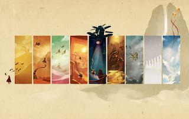

Journey is one of those games you can't judge from screenshots or gameplay videos. It has to be played to be experienced.

You start in a desert with no idea who you are or what your goal is — just a distant mountain with light pouring from its peak. That's enough. The game starts slowly, but within a few minutes the controller wasn't going to leave my hands until the credits rolled. I played it straight through to the end without stopping for a second.

The soundtrack does something special. It shifts with the mood of wherever you are — from the quiet of wind blowing across sand to a full wave of music filling the room at exactly the right moment. thatgamecompany made something here that goes well beyond what most games attempt.

As you travel you'll encounter other players wandering the same world. They can't speak or chat — only chirp — and there's no loading screen when they appear. Someone is just suddenly there beside you, a stranger playing their own version of the same journey. At one point I finally found someone who understood I wanted to stop and meditate for twenty seconds with them. One of those small, inexplicable moments that only this game can create.

The world is more varied than the desert introduction suggests — there are other places, other moods — but I won't go into details. The less you know going in, the better.

Some games tell you a story. Journey gives you one to live, and yours will be different from everyone else's.
