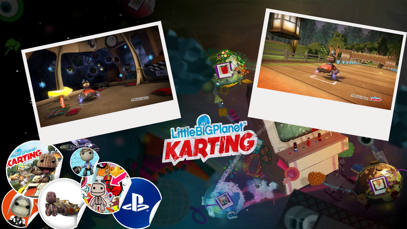
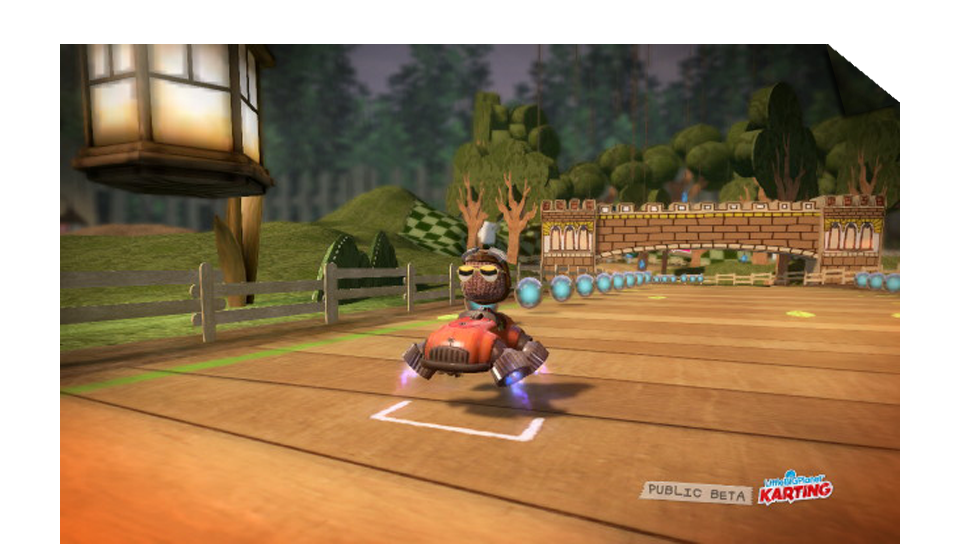
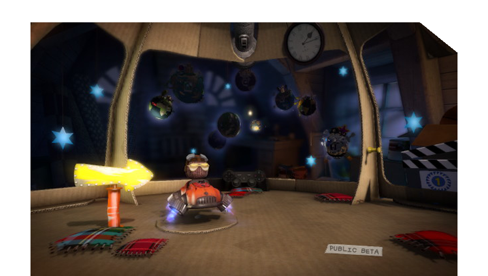

The LittleBigPlanet Karting beta has ended. I didn't have a huge amount of time with it, but the time I did have was great.

What surprised me most was how well it worked and how much it still felt like a proper LittleBigPlanet game despite being a kart racer. There are plenty of customisation options and a good variety of vehicles — they feel distinct from each other to drive, though they're all balanced at the same speed and grip. The level editor is reminiscent of ModNation Racers but more open — easier to move around in and more freedom to shape things the way you want.

While waiting for the full PS3 release, I made three wallpapers from the two screenshots I managed to take during the beta.

Now just waiting for the full release.
