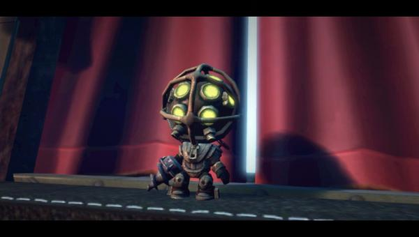
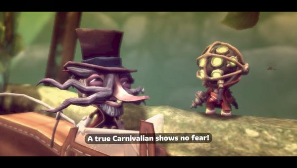

Got LittleBigPlanet Vita and jumped straight in with my Big Daddy skin — off to a great start.

Then an install error hit and killed the mood for two days straight. Genuinely worried I'd need a refund. PlayStation support came through and sorted it out, so I picked up the corrected version and got back to it.

After all that, it was absolutely worth it. Everything just feels right — the controls, the creation tools, the whole package. The built-in game library is noticeably bigger than in previous versions, which is a nice bonus. One complete day spent playing and it was super fun throughout.

The only thing I'm still hoping for is more costume options from the earlier games. The selection right now is limited, but I'm happy enough with the BioShock costume in the meantime. Hoping the developers round that out soon.
