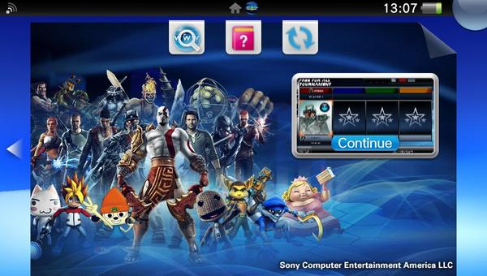
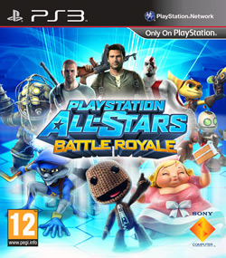
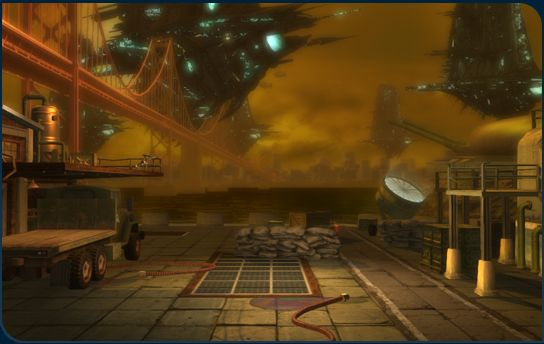
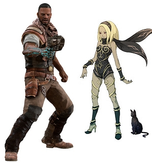
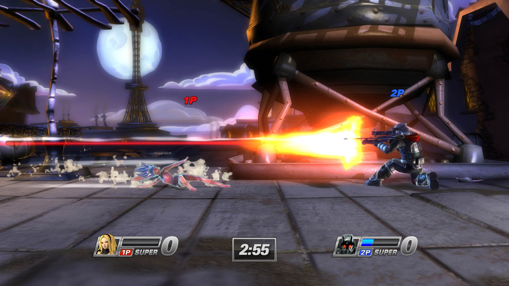
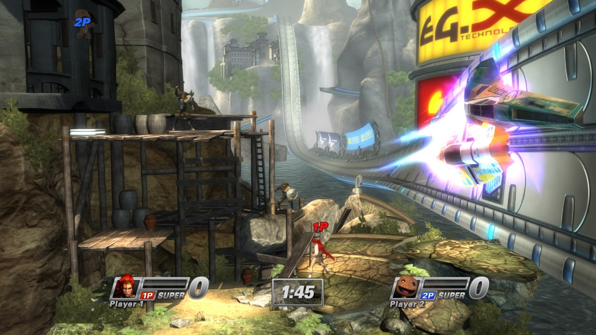

Played both the closed and open beta on PS Vita before the EU launch — had a great time and was really looking forward to getting the full game.

The full release did not disappoint. I picked it up for both Vita and PS3 and have been enjoying it more the longer I play.

## Not Super Smash Bros.

The comparison to Super Smash Bros. is inevitable, but the games work differently. In All-Stars there are no ring-outs — instead you build up a super meter to unleash kill moves on your opponents. The meter has three tiers, with stronger supers unlocking at higher levels. It changes the pacing completely and rewards building up meter smartly rather than just landing hits.

## Stages

The stages are a highlight. They mashup two PlayStation franchises at once, so you might get a Heavenly Sword arena that suddenly gets disrupted by Wipeout racers tearing through it. The hazards are varied and keep matches from feeling static.

## Multiplayer

Local and online multiplayer work well together. Despite the very different characters, the game feels balanced — nobody feels obviously broken. The one thing I'm hoping gets added is a proper 1v1 online mode, since right now that's missing.

## DLC — Kat and Emmett

The first DLC characters are confirmed: Kat from Gravity Rush and Emmett Graves from Starhawk, arriving in January. Kat was my most-wanted addition — having just finished Gravity Rush — so this is great news.

Hoping the roster keeps growing. More characters, more modes, and that 1v1 online option — there's a great foundation here to build on.
