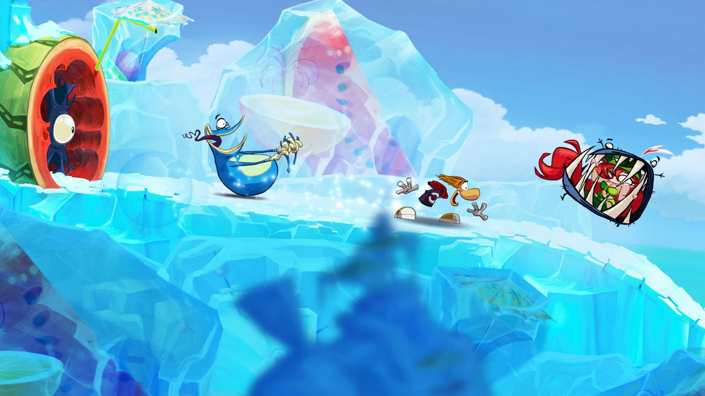
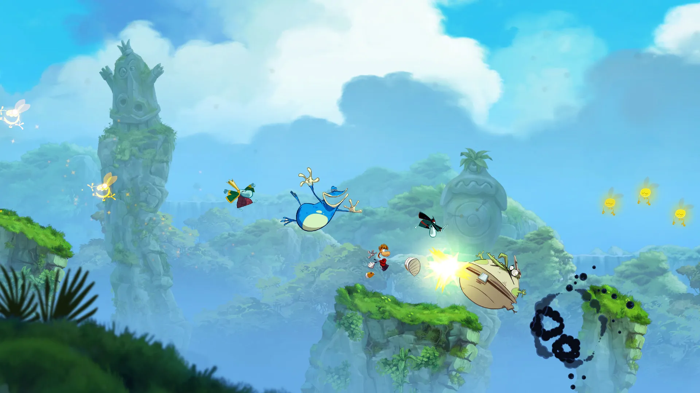

It's been a long time since a Rayman game felt this good.

Rayman Origins doesn't look much like the recent Rayman games — it's closer in spirit to the original, but with a far more colourful and vibrant look. Every level is a work of art. The soundtrack matches it perfectly, making the whole thing feel like an interactive cartoon that never stops being fun.

I was sold on the demo alone. The controls are immediately accessible — simple enough that anyone can pick up a controller and play from the first minute, but the game still rewards skill. As you progress you get better without ever getting more complex controls to manage, which is exactly how it should work.

Rayman Origins is technically a solo game but it's a completely different experience with a second player. More chaotic, more fun, endlessly replayable. It's available on almost every platform, which is great since it suits almost any living room.

The one thing I missed was a real story. There's a short intro and outro, but nothing in between. It doesn't make the game worse, but it would have been nice. A few more character skins beyond Rayman, Teensies, and Globox would have been welcome too.

On the difficulty side, the main game scales nicely — accessible for casual players but the extras will push anyone. Time trials, tooth fairy levels, and an unlockable undead stage that is genuinely brutal. Getting a gold on those is pure satisfaction.

The PS Vita version is also worth mentioning — the zoom feature lets you actually appreciate the level artwork up close, which is a lovely touch. Less ideal for co-op, but a great portable experience.

An easy recommendation for anyone who wants something beautiful, fun, and different on their shelf.
