After driving up from Meppen to Cologne, we finally made it to Gamescom 2013. Two days, a lot of queuing, and some great memories.

## Day 1 — Friday

Getting in was a bit rough — the ticket scanners were giving everyone trouble at the entrance — but once inside it was worth it.

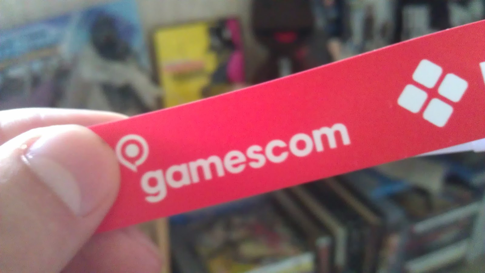

Hall 9 was the first stop: anime merchandise, game apparel, half PC and Nintendo games, the usual browsing ground.

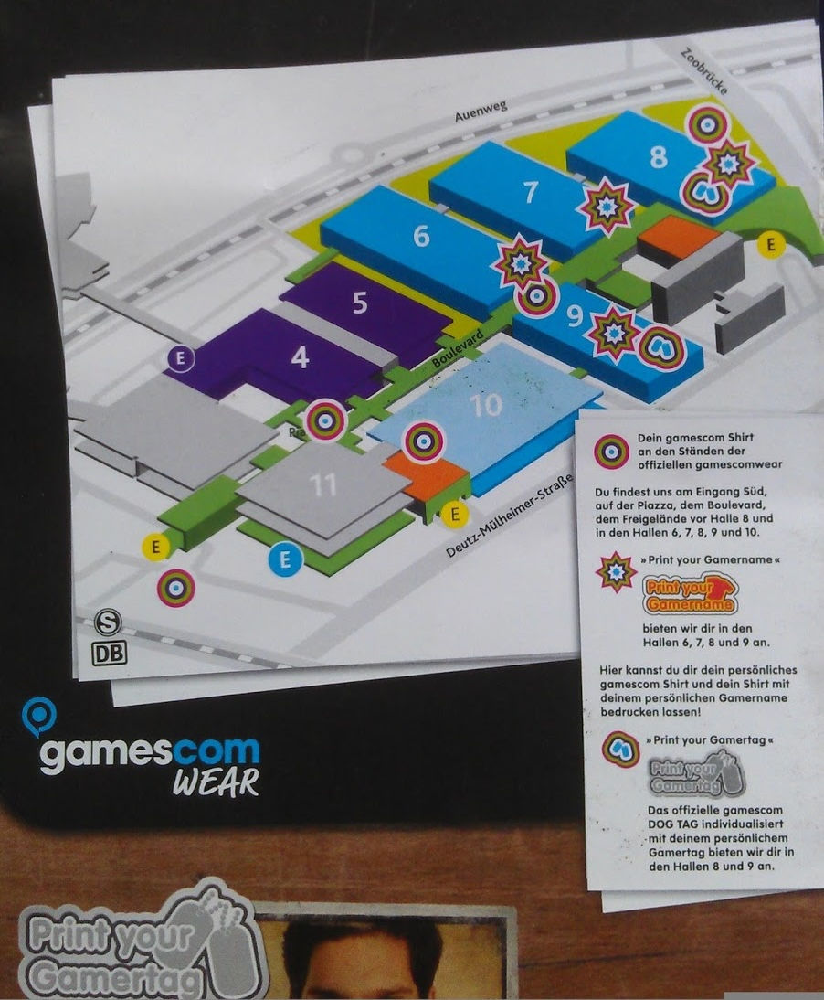

The PS Vita stand had Killzone Mercenary playable and it was immediately impressive. It really does feel just like Killzone 3 — and on a handheld, that's amazing. Also got to try Doki Doki Universe which was a fun surprise.

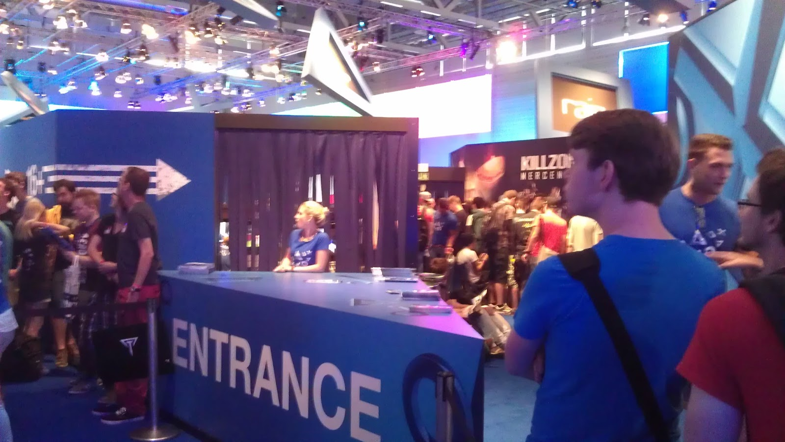

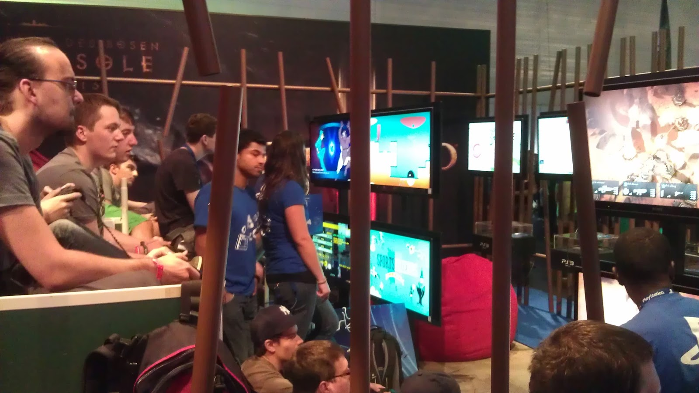

The PS4 stand was the big one. Four hours in the queue, which sounds painful, but the atmosphere kept it moving. I got to play Drive Club and spend some time with the new DualShock 4. The controller feels great — comfortable, well-balanced, and a real step up.

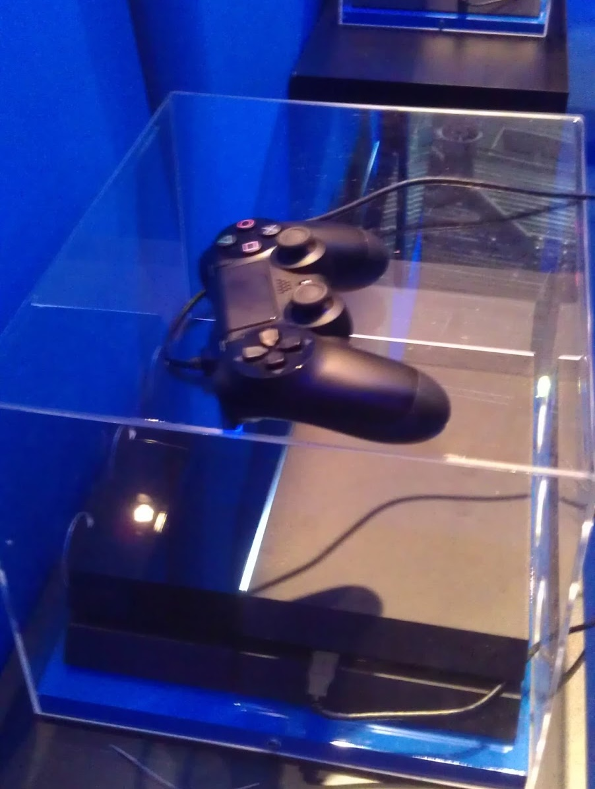

Rounding out the day was a live Watch Dogs presentation focused on the online multiplayer — one of the highlights of the whole trip.

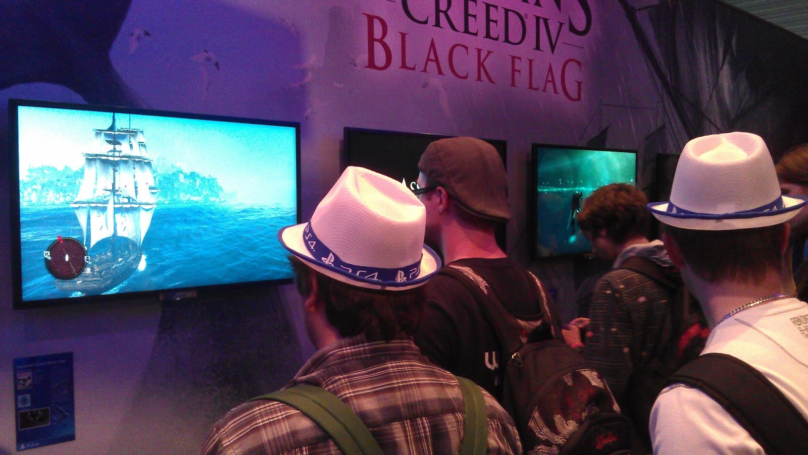

On the way out I picked up a Sackboy plushie, a StarCraft Terran t-shirt, and a One Piece hoodie. Ended the evening with a proper schnitzel dinner.

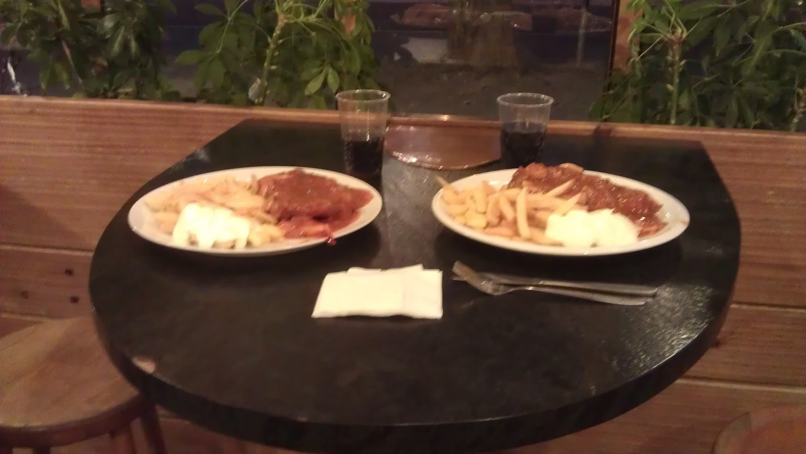

## Day 2 — Saturday

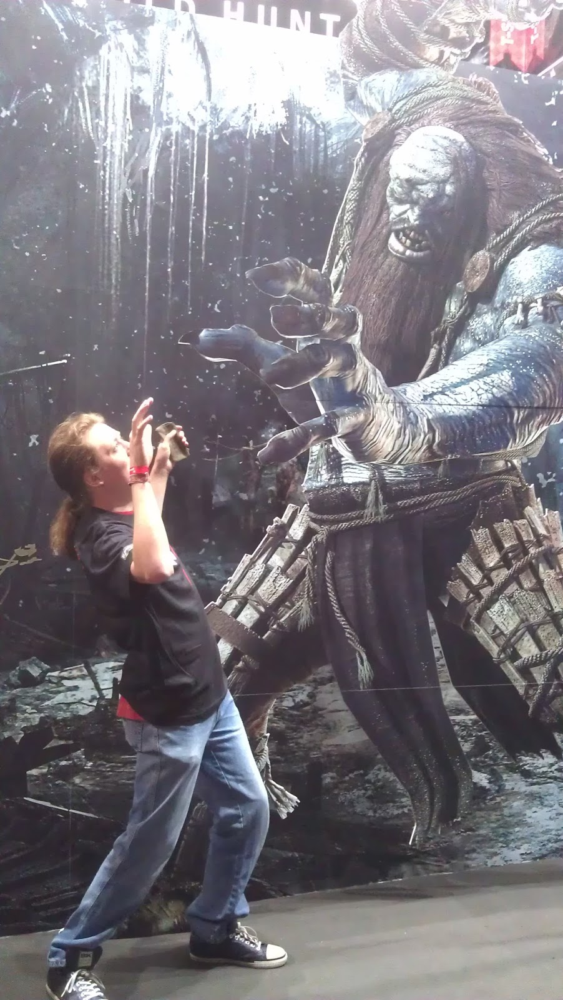

Bethesda had Elder Scrolls Online playable with an hour wait for a 30-minute session. Worth it. The MMO format translates better than I expected — it felt like The Elder Scrolls while still doing its own thing online. Also got hands on with Wolfenstein at the Xbox 360 stand.

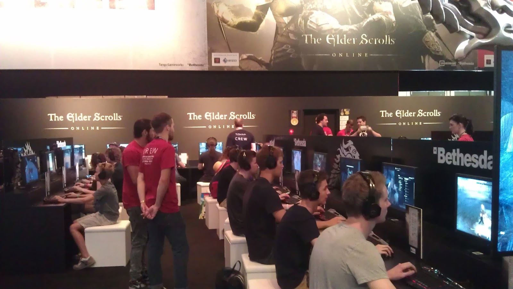

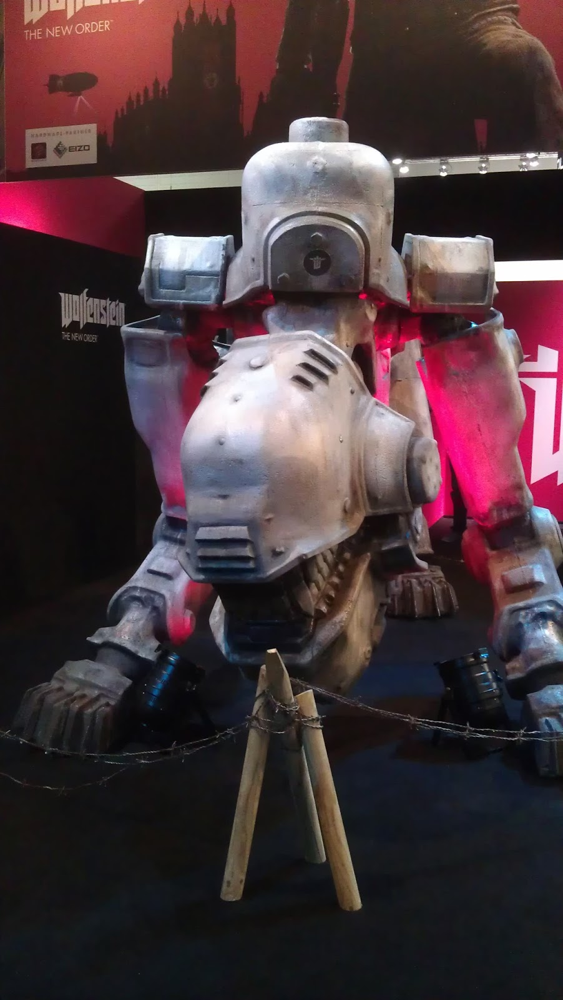

Hall 8 had a live StarCraft II tournament running with English commentary. I spent a good chunk of time just watching matches in front of two massive screens — always a pleasure to see high-level SC2 played in person.

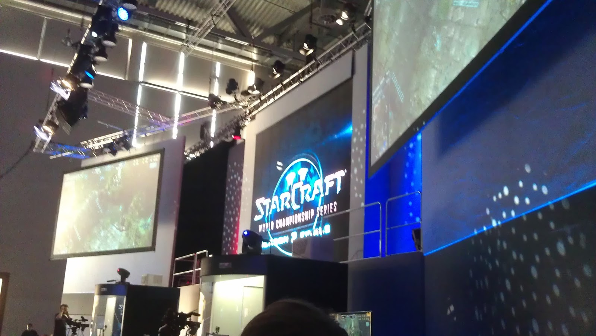

Hall 10's cosplay village was a great final wander before calling it a day. We ended with traditional Cologne food and a Kölsch at a local brewery — a proper send-off for a great two days.

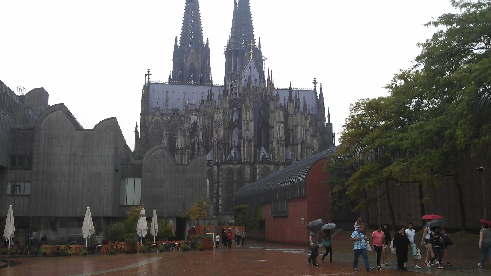
