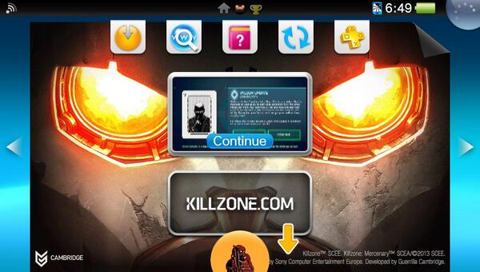
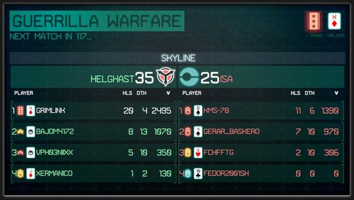

After two mediocre FPS games on Vita, Guerrilla delivered something genuinely good.

I got early access and started my day with it immediately. The campaign links directly to the events of Killzone 1 and Killzone 2 in ways that reward knowing the series, and Mercenary's mercenary protagonist gives it a different angle from the main games. It felt like a proper Killzone — not a scaled-down portable version.

## Multiplayer

What kept me busiest wasn't the campaign. It was the multiplayer — and not just because of the trophies, though I do want those too.

Something about this mode changed how I naturally play. In Killzone 2 and 3 I was a sneaky sniper type. The 4v4 format here pushed me toward something more direct: SMG or assault rifle as primary, aggressive but tactical. The smaller teams mean you can't rely on someone else covering for you — you have to be able to hold your own when you're isolated.

The weapon system is the smartest thing in the game. Your loadout carries across both campaign and multiplayer, and so does your currency. Stuck on a single-player section? Play a few multiplayer matches to earn cash and upgrade. It makes the whole game feel connected rather than two separate modes bolted together.

My preferred Warzone loadout:
- **STA-52se** — reliable for direct assault situations
- **M80** — anti-air and anti-sniper; the lock-on is simple but effective
- **M133 PROX** — defensive, good for catching people in unexpected moments
- **Armour** + Vanguard to control the map and force enemies into corners

Still working on bringing the STA-14 back into rotation — it was my primary in Killzone 3 and I haven't fully committed to switching back yet.

One honest downside: match length. A Warzone match runs 20 to 30 minutes, which is fine at home but too long for a normal commute. You need to actually sit down for this one.

Side note: there's a free Killzone Mercenary art book available on Vita. Get it.

## Christmas

Came back to it over Christmas and ran wild. Still one of the best things on the platform.
