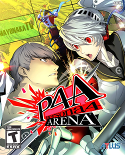
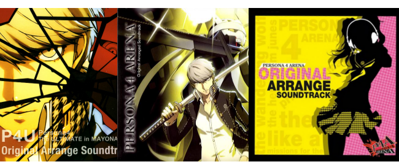

Nine months after the US release, Persona 4 Arena finally made it to Europe. I could have been annoyed about the wait — and I was, a little — but complaining without buying doesn't send any signal worth sending. So I bought it.

## Training mode

The training mode might be the best thing in the game. It's a genuine tutorial for anyone new to the genre, but just as useful for players who know fighters and need to get the feel of this specific system. One confusing thing: controls are described using the P4U arcade layout rather than standard PS3 button labels. Understandable since it started as an arcade game, but it catches you off guard until you adjust.

## Story and Arcade modes

Story mode is long on dialogue, short on battles. If you're a Persona fan who wants the narrative, you can drop the AI difficulty to near-zero and move through it quickly — a thoughtful option to include. Arcade mode flips that: shorter story segments, more fights, and a better place to get comfortable with the controls before jumping online.

The one disappointment in the story: each character has their own version of events, which sounds good but ends up feeling like the scattered narratives you see in lesser fighting games. The main thread is the same regardless of who you pick, and the ending is nearly identical across all routes. It leaves things open, which either sets up a sequel or just leaves it unresolved. I'd like a follow-up — more P4U, or something that carries the story forward toward Persona 5.

## The fighting system

Fast, combo-heavy, but not overwhelming. Learning the basics is accessible; the real challenge is not panicking and button-mashing under pressure. The Persona follow-up attacks — chaining moves with Izanagi, Thanatos, Konohana Sakuya and others by repeating the persona button — give each character a distinct rhythm once you're past the basics.

## The music

Persona music is some of the only video game music I actually listen to outside of playing. It shows up in my regular rotation alongside metal, which is an unlikely combination. The full soundtrack is available in the Gallery in-game, and the Arranged OST that came with the game has different cover art depending on the region — a small detail but a nice one.

My personal favourite: **The Wandering Wolf**. Worth seeking out even if you've never played a Persona game.
