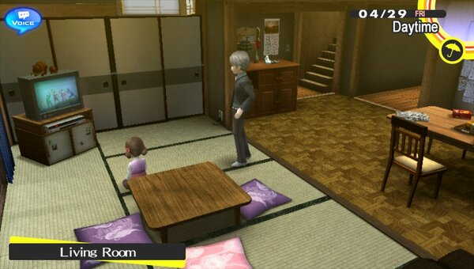
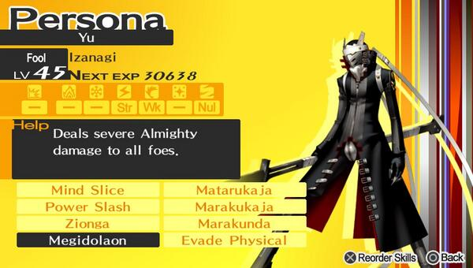
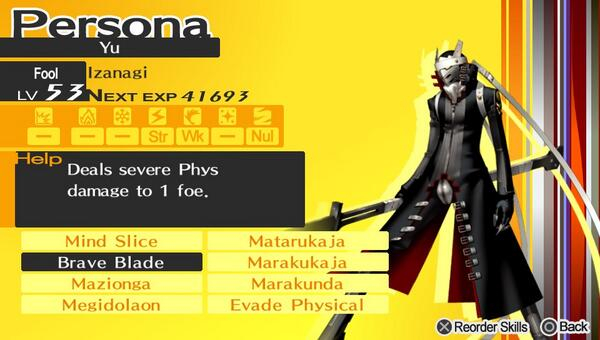
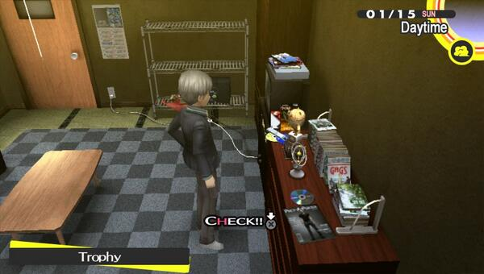
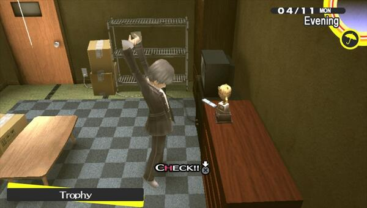
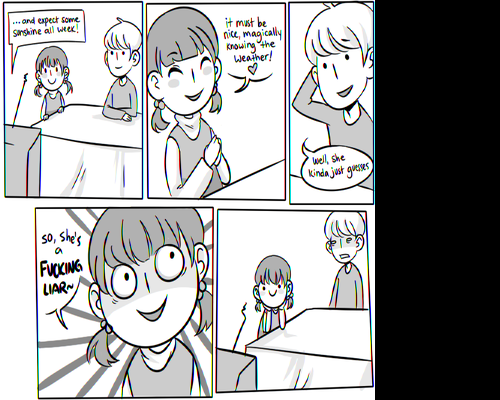

**February 22, 2013** — Enjoying Persona 4 Golden a lot, this has been worth the wait.

**February 24, 2013** — Power Rangers on TV!

**March 5, 2013** — Playing Persona 4 Golden like an addict! I am sooo happy it is finally here in the EU — I've been reading how people in JP and US really liked it which makes me want even more. It always bugs me that I have to wait 3 months for a game to release here.

**March 31, 2013** — Izanagi!

**April 3, 2013** — Izanagi again!

**April 13, 2013** — Lol, there is now a trophy in my room from the Midnight Trivia Miracle Quiz.

**April 19, 2013** — Completed Persona 4 Golden and already starting a NG+ with my weird trophy already set!

**June 1, 2013** — You're in trouble now Yu! 😄

