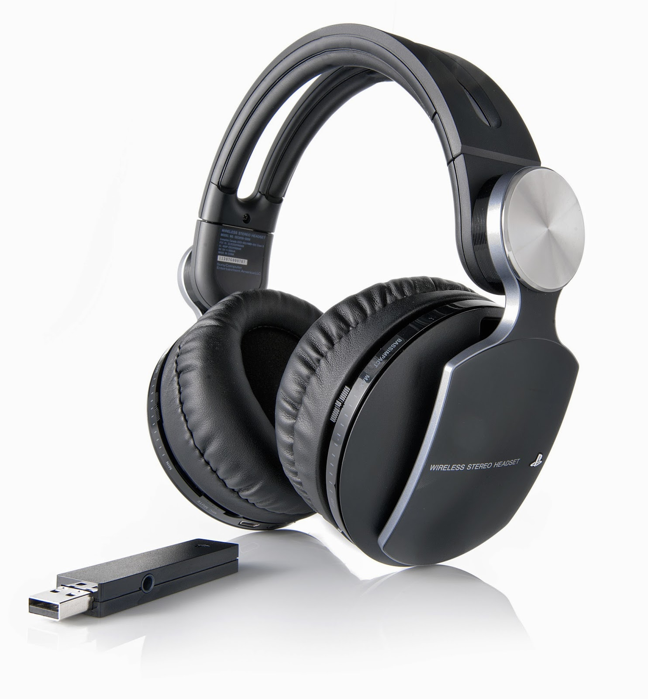
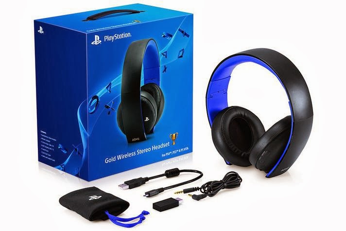

Picked this up today and immediately tested it on multiple devices — WOW. This thing works really well.

After six months with it I can give a proper account of how it's held up.

## Why I got it

I needed something that could handle PS Vita on the go, work with my mobile, and still do voice chat on PS3. The Pulse Elite covers all of it. It connects via USB dongle for PS3 and any USB-equipped device, and via a standard 3.5mm cable for everything else. No software to install, and the 3.5mm connection works even with the headset powered off — which matters more than it sounds when the battery dies mid-session.

## Comfort and build

The ear cups are slightly tilted inward, which gives them a more natural fit and subtly enhances the stereo effect. Day-to-day it's comfortable, but the weight starts to make itself known somewhere around the four to five hour mark. Not a dealbreaker for normal sessions, but something to be aware of for long gaming nights.

## Audio and microphone

The 7.1 virtual surround sound is the headline feature and it delivers — games with positional audio feel noticeably different through it. The microphone is the other standout: people I've chatted with have said it sounds like I'm right next to them. Clear and natural. The one caveat is that some mobile devices pick up an echo from the mic — I couldn't pin down exactly which ones, but it's worth knowing it happens.

## Six months in

Still very happy with it. PS4 support was confirmed with the 1.60 system update, so it's going to stay in the setup for a long time yet. At €160 it's not cheap, but Sony also announced a standard Pulse PS4 edition coming at €90 with the same 7.1 surround. Either way, if you're looking for a headset that works cleanly across PlayStation hardware and mobile without any fuss, this is a solid pick.

