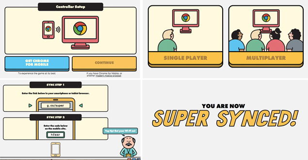
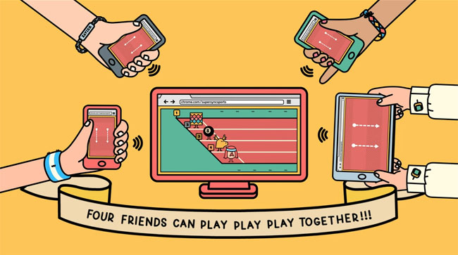

> [!WARNING]
> Because Chrome Super Sync Sports relied heavily on legacy browser features like NPAPI/WebSockets as a Chrome Experiment, it was taken down and is no longer playable on the official Experiments with Google page.

Super Sync Sports was a Google Chrome Experiment worth your time. It's a multiplayer sports game where you use your phone as a controller while watching the action on a PC or TV screen — and it all runs in the browser. No download, no specific hardware requirements, just a decent internet connection.

The whole thing is built on HTML5 and CSS3, which makes it impressive as a tech demo as much as a game. You head to the link in Chrome, follow a few quick setup steps, and you're playing. Once you're connected, jumping into a rematch or switching sports is instant — the setup friction only really hits you the first time.

There are three mini-games based on different sports, each requiring you to rapidly repeat a specific movement on your phone. They're fun, but they're all fairly similar to each other — the sport changes, the movement changes, but the core loop is the same throughout. Visually it looks really clean and polished, which is a big plus. The sound is fine, nothing that stands out.

The main limitation is that you need to be in the same room as a PC or Smart TV — it's not something you can play anywhere. Best with friends, though playing solo is possible if you just want to try it out.
