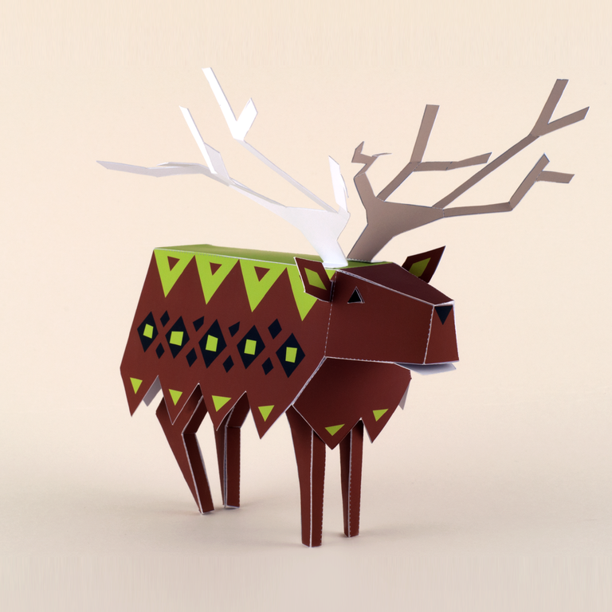
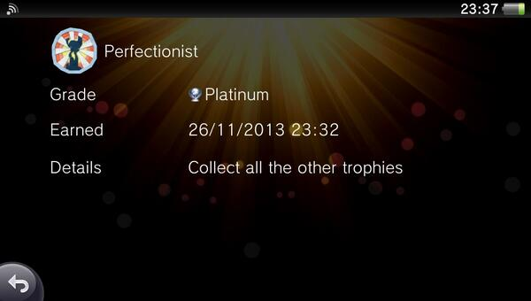

After some deliberation I went with the jukebox pre-order pack — and then spent the next ten days waiting for it to download and actually play the thing.

It was worth every second.

## The world becomes yours

Tearaway is from MediaMolecule, the studio behind LittleBigPlanet, and that pedigree shows immediately. But what caught me off guard was the personalisation. As you play, the world gradually fills with things you've put into it — designs, choices, small details that persist right through to the end. By the time the credits rolled, the ending felt genuinely mine in a way that almost no game manages. I was completely addicted.

## Controls and exploration

The tutorial is woven into the game so naturally you barely notice it. Jump mechanics don't even appear until the second chapter — which at first feels slow, but turns out to be intentional. Going back to earlier areas once you have new abilities and finding what you missed is a real pleasure.

The Vita's unique controls — touchscreen, back panel, camera, tilt — are all used thoughtfully. It never feels gimmicky. The world of Tearaway pulled me forward the whole way through.

## Combat

The one area I'd push back on is combat. Fighting the Scraps works fine and the mechanics evolve as you go, but enemy encounters sometimes break the flow of exploration at the wrong moments. I found myself wishing there was more use of the back-touch panel in those moments rather than falling back on dodge-and-throw.

## The papercraft feature

One brilliant touch: photograph certain items in the game and you unlock downloadable papercraft versions you can build in real life through the companion ME page. It extends the world beyond the screen in a way that feels genuinely creative rather than just a marketing add-on.

## My StraySheep Elk

## Platinum

Four days after finishing the story I closed my journey through Tearaway with my 25th platinum trophy. The campaign is short — that's the one honest criticism — but every minute of it is lovely. A game I'll think about for a long time.
