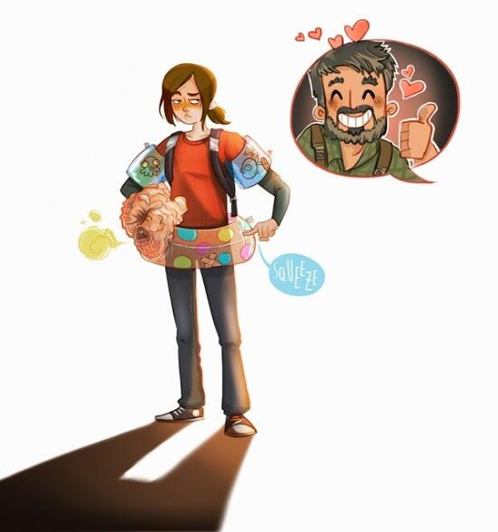
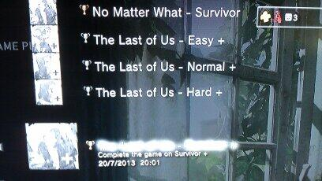

The Last of Us arrived and I didn't put it down.

The first two parts of the campaign felt strikingly real in a way I didn't expect. The Clickers were immediately giving me trouble — every encounter where I had to decide whether to fight or sneak past felt genuinely tense. That tension never really lets up. By early July I was 90% through and had to wait three more days before finishing the last stretch. I was thinking about it constantly.

It ended the way great games end: you're sad it's over. Just wow.

## Factions

After the campaign I expected to move on, but the multiplayer pulled me back. I'd assumed it would be another Uncharted-style experience — fun but disposable. It isn't. Factions takes the stealth and resource management from the campaign and rebuilds it as 4v4 team matches on maps drawn from the single player.

Supplies are limited and you start most fights with only a few bullets. Health drops fast, cover becomes essential, and gun-running the way you might in other shooters gets you killed immediately. Every match felt intense — sneaking up on someone and taking them down without triggering the rest of their team was satisfying in a way I hadn't expected multiplayer to be.

Playing with three strangers still felt like playing as a team. That's rare.

The loadout system is simple compared to something like Modern Warfare where setup takes fifteen minutes. Here you spend a limited pool of points on guns and perks, which makes your choices matter without turning it into a homework assignment before every session.

One genuine tip: play with a headset. Through my Sony Pulse Elite I could hear teammates before I could see them — footsteps, direction, movement. It completely changed how the game played.

The one thing I kept wishing for was a survival mode against the Infected. Drop a small group of players on a map with limited resources, survive waves. Maybe as future DLC.

I ended up playing more for the fun than for any trophy, which is always the sign of a multiplayer mode that's actually good.

## Survivor+

Finished a second playthrough on Survivor+ and cleared all the story trophies. A great game to run through twice.
