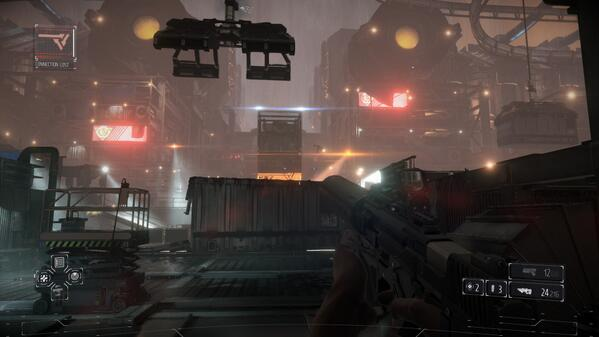
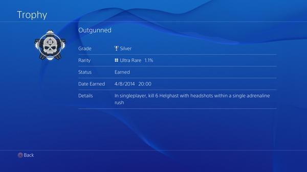
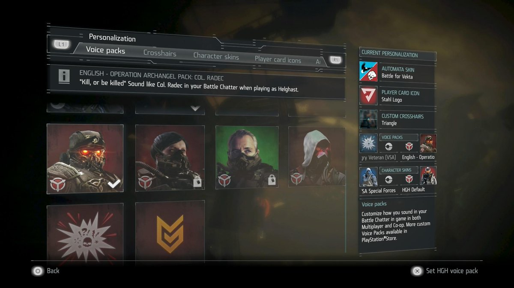

**May 16, 2014** — Don't have a PS4 yet, but I am looking forward to this. Also is any one wishing for a 2 player splitscreen option?

**June 18, 2014** — Loving the power of choice, clean kill and patience.

**August 4, 2014** — Tried to get this trophy via guides that all used stun, never succeeded — so I tried it with an attack drone. Pling! 🎮

**November 6, 2014** — All set with the new personalization options in Killzone but no one is touching my Radec voice! 😄

