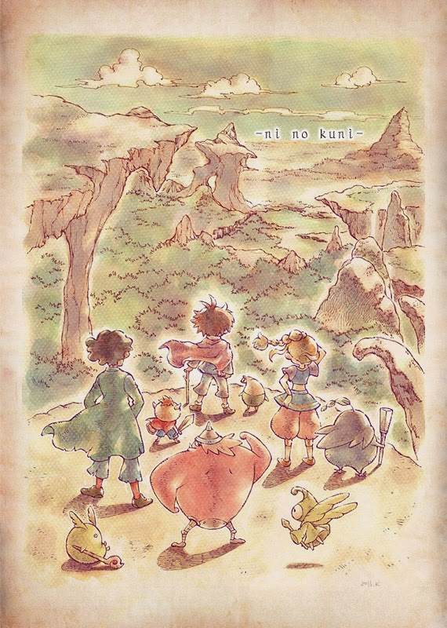
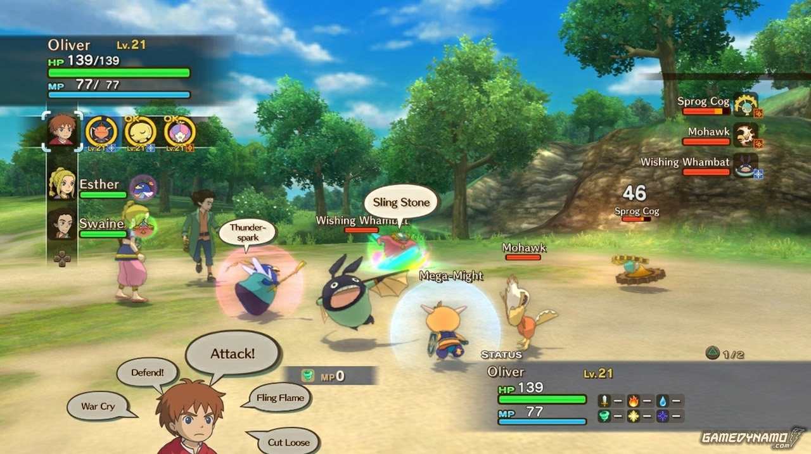

With so many RPGs out there it's hard to find the right one.

Most of them are so focused on their battle systems that they forget the main reason people play them. What drew me into the good ones was always the world I had to explore and the people living in it. Grinding for hours to get past a boss never felt epic — just tedious.

Ni no Kuni gets this right. I wasn't done with it even after I finished the story.

## The world

Every part of the world was a delight to explore. Screenshots don't do it justice. The art style comes straight from Studio Ghibli — who were involved in the game — and their fingerprints are all over the way the world looks and feels. Even the monsters have that rounder, friendlier Ghibli aesthetic, which might make the game look like it's for kids, but the story goes to genuinely dark places, especially early on.

The orchestral soundtrack matches the world perfectly. It's not everyone's taste but it hums through the whole experience and makes traversal feel like it has weight.

## The combat

The battle system borrows from two places: Tales-style movement (you can move freely during combat) and Pokémon-style creature battles (you fight with monsters you own). Both systems work together well and make combat feel like more than just number management.

## How I played it

My approach was to clear all side quests before moving the main story forward. I'd recommend the same to anyone. The side quests here aren't just hunting or gathering fetch tasks — many involve healing the broken hearts of characters you meet, which ties directly into one of the game's central mechanics. They feel like part of the world rather than optional filler.

## Story

You're not fighting evil as some supremely powerful hero. You're a boy doing it for his own reasons, and that framing makes the story feel different. Your companions feel genuinely developed rather than functional support characters.

This is a must-play. I already know I'm going to miss it when the last two side quests are done.
