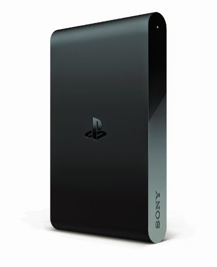
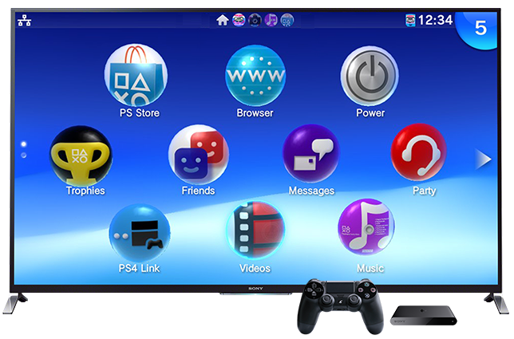
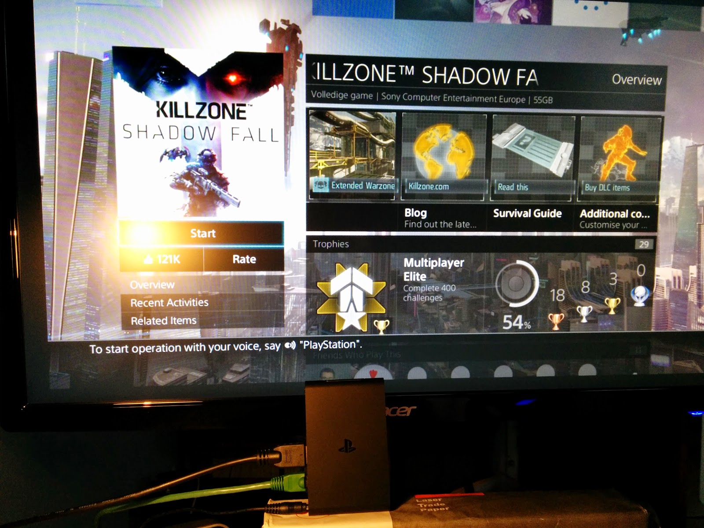
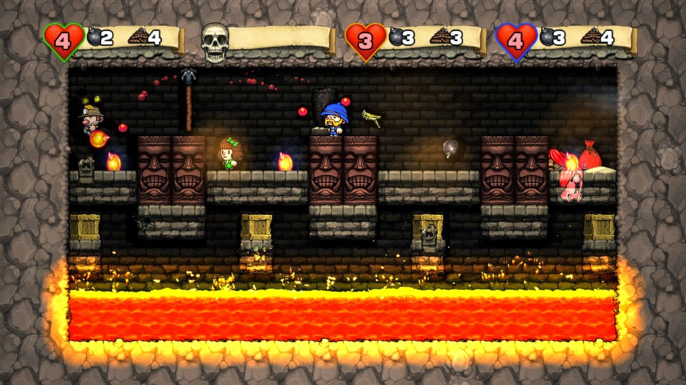

The PlayStation TV is the way to play Vita games and PlayStation classics on a TV, or to use as a PS4 companion device for remote play in another room. On paper it's a great idea. In practice it's a device that works well in some situations and shows its limitations in others.

## What doesn't work

The compatibility list is the biggest frustration. Many good Vita games don't support PSTV — anything that relies heavily on the touchscreen or motion controls is out. If you're new to the Vita ecosystem don't expect to play Gravity Rush or Tearaway on it. Games like OlliOlli have no proper menu navigation without using the R3 button or Dualshock 4 touchpad. WipEout 2048 is blocked despite its motion controls being entirely optional — Sony please just whitelist it, it would look great on a TV. Several video services are also unsupported for no obvious reason.

## The price

The PSTV itself is €99, but that's not the full cost. Add a controller (€50) and a memory card (8GB at €20) and you're looking at around €169. Still reasonable for a micro console, but worth knowing upfront.

## Remote play

As a PS4 add-on the PSTV is genuinely great — I noticed no lag playing via remote play on my home network. There is some quality loss if either device is on Wi-Fi, so the advice is to connect both via LAN for the best experience.

## As a standalone device

The UI is the weak point here. The Vita's interface was designed for a handheld and it shows when displayed on a TV — navigating it feels like more work than it should. I hope a PS4-style UI comes to the PSTV eventually.

There's also no separate PSN login for the PSTV. Signing in on one device logs the other out, because the PSTV is recognised as a Vita by PSN rather than as its own device. A small but annoying limitation.

## Games that shine

Some Vita titles look rough scaled up to a TV and really should have received HD updates for PSTV. But a few stand out for doing it right. Spelunky and Guacamelee play exactly like their PS3 versions and both support couch multiplayer through the PSTV — a genuine reason to own one.

Persona 4 Golden and Killzone Mercenary just look great on the TV. Watching the Persona 4 Golden opening on a proper screen is something else. PlayStation classics were always made for TV so Crash Bandicoot and MediEvil feel completely at home.

## Portability

The PSTV is small enough to take to a friend's place easily. I've used mine as a second console at my parents' house and it works perfectly for that. Ad-hoc multiplayer between a PSTV and a Vita using the same account works just like two Vitas would.

## Summary

The PSTV is a good device that needs more support. The compatibility list needs to grow, the UI needs rethinking for TV, and PSN needs a dedicated PSTV category with a couch multiplayer subcategory. The foundation is solid — it just needs time and love.
