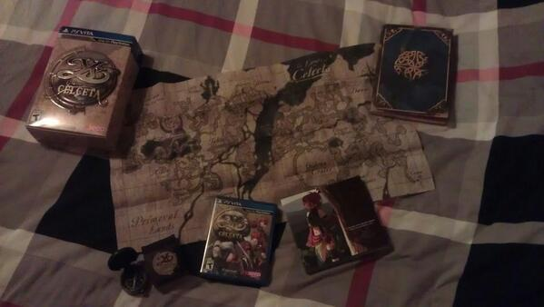
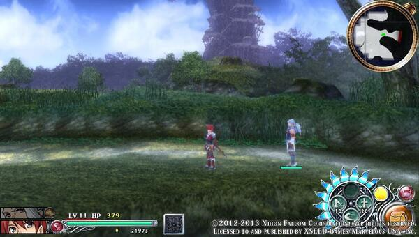
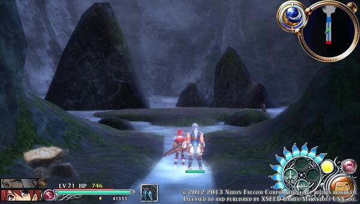
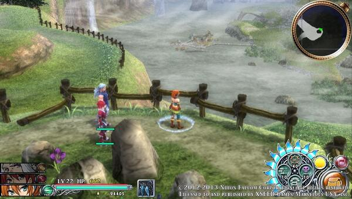
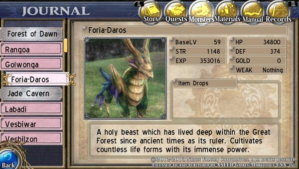

**January 18, 2014** — Looking forward to actually playing this game but for now I am going to enjoy this collectors edition of Ys: Memories of Celceta.

**February 9, 2014** — Although Ys isn't the best looking graphically I really enjoy the environment and those distance angles are the best.

**February 15, 2014** — Now that's a huge waterfall. Damn, I was down there in that town!

**February 23, 2014** — And... down it goes! 😄

