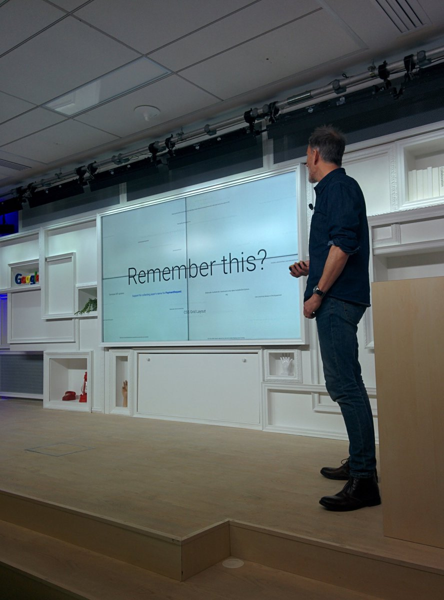
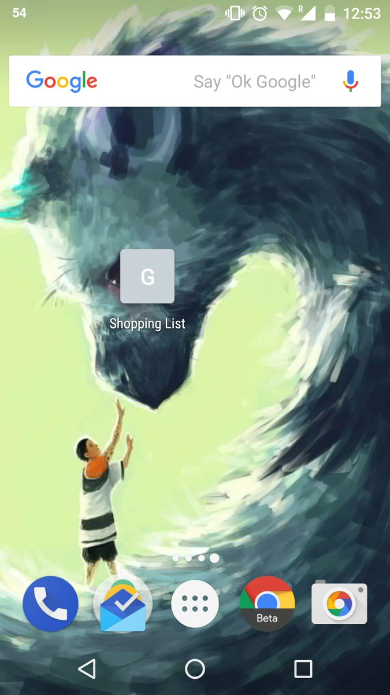
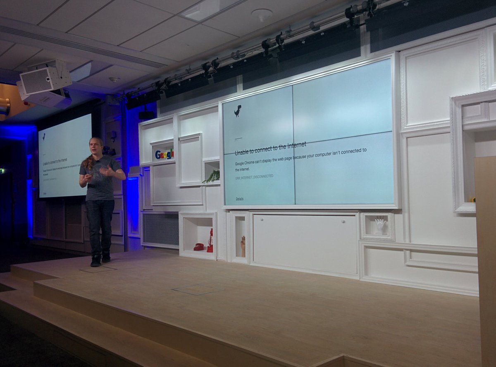
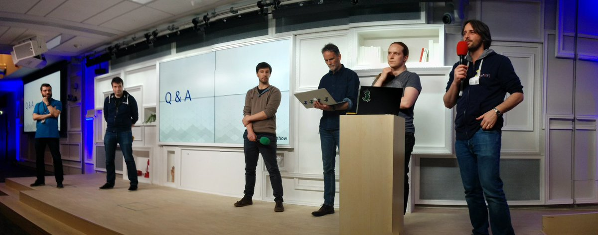

Ready for the PWA Roadshow in Paris! Great to see Lighthouse getting some spotlight.

A few interesting Q&A moments: whether you can exclude URLs from service worker caching for PHP CMSes (like `/admin`), whether PWAs will show up in the Play Store like on the Microsoft Store, and whether the Google Shopping list will ever get PWA support — at least give it a manifest! 😉

Thank you to the PWA Roadshow Paris team for everything!

