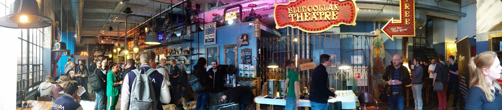
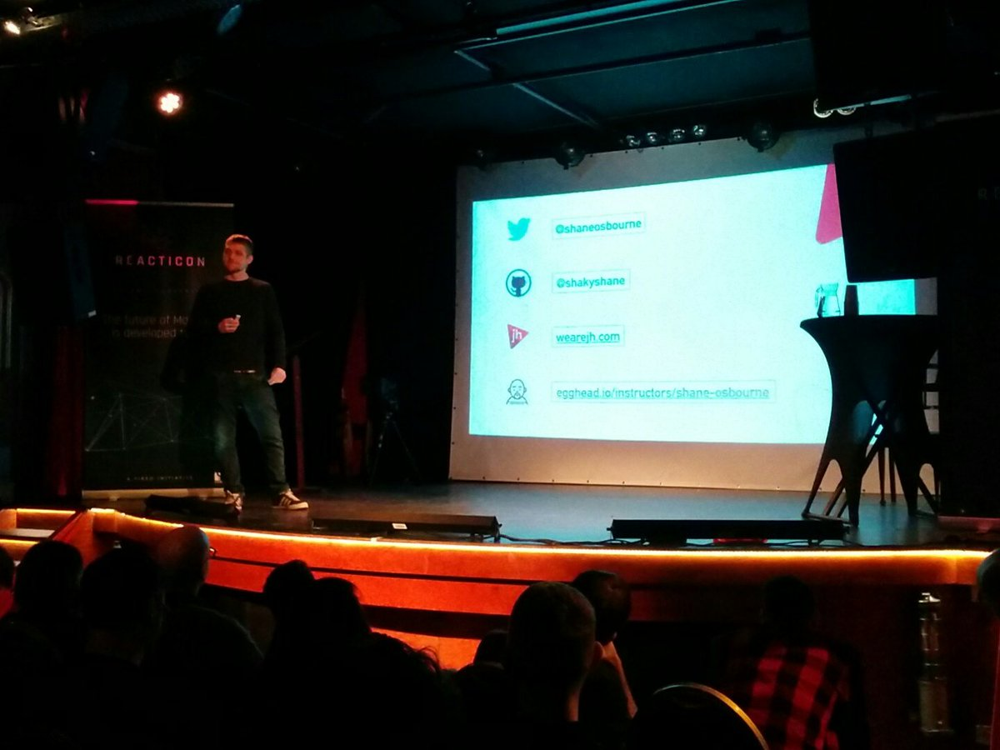
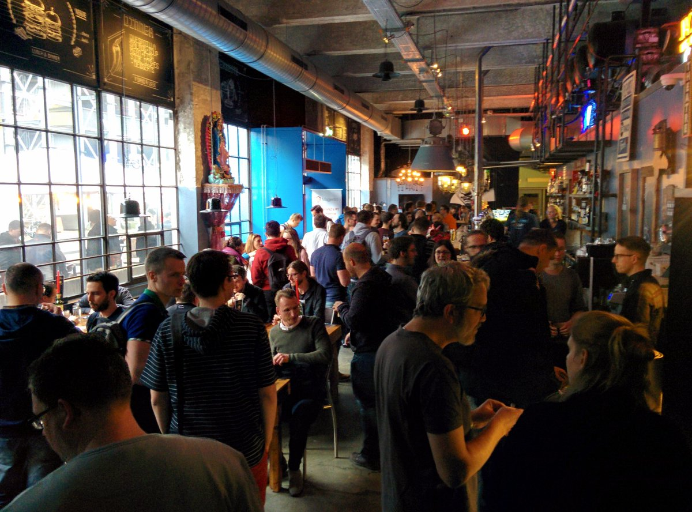
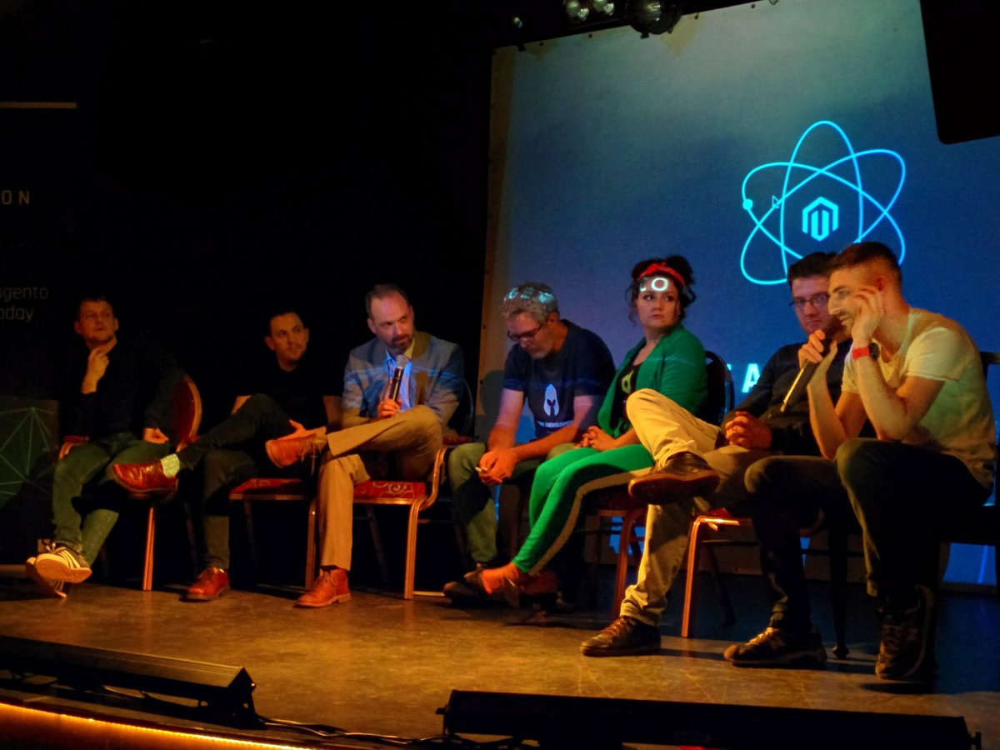
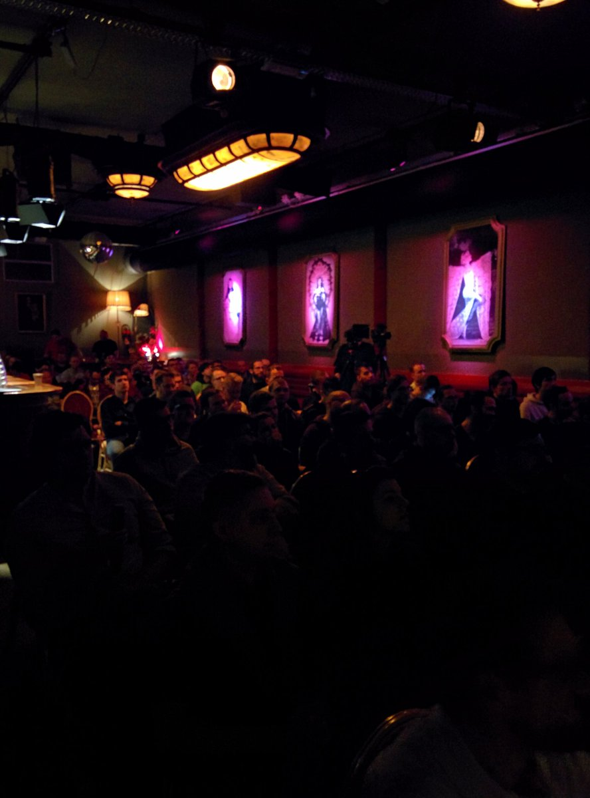
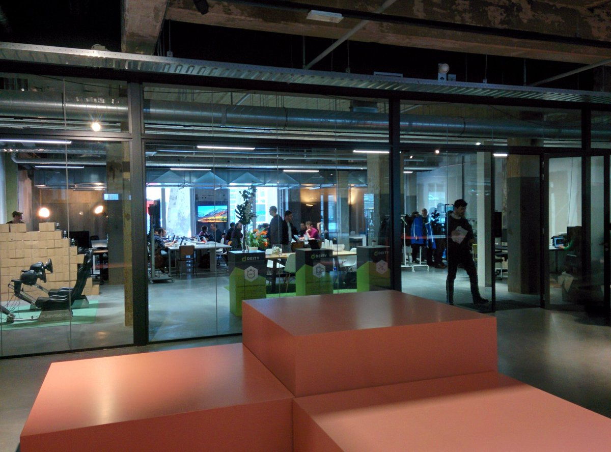
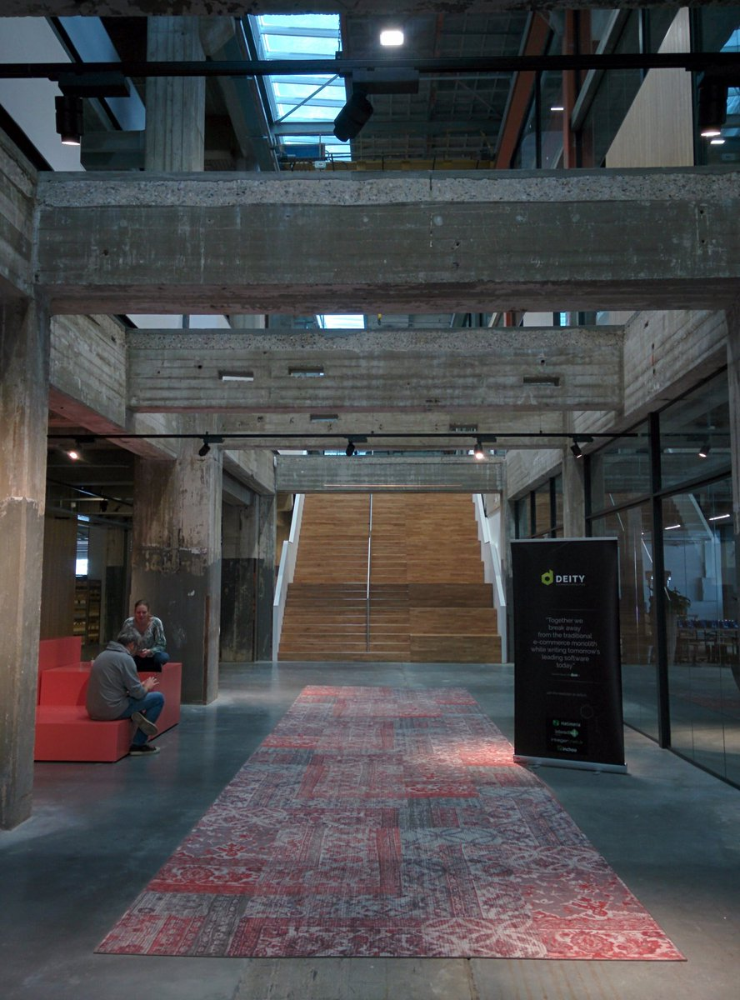
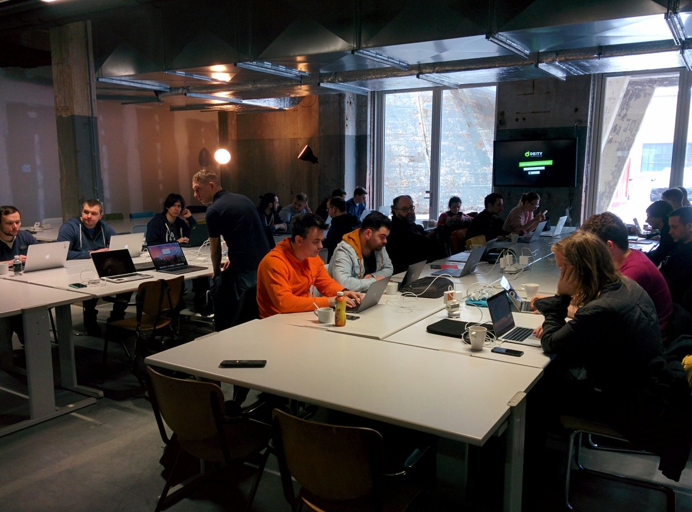
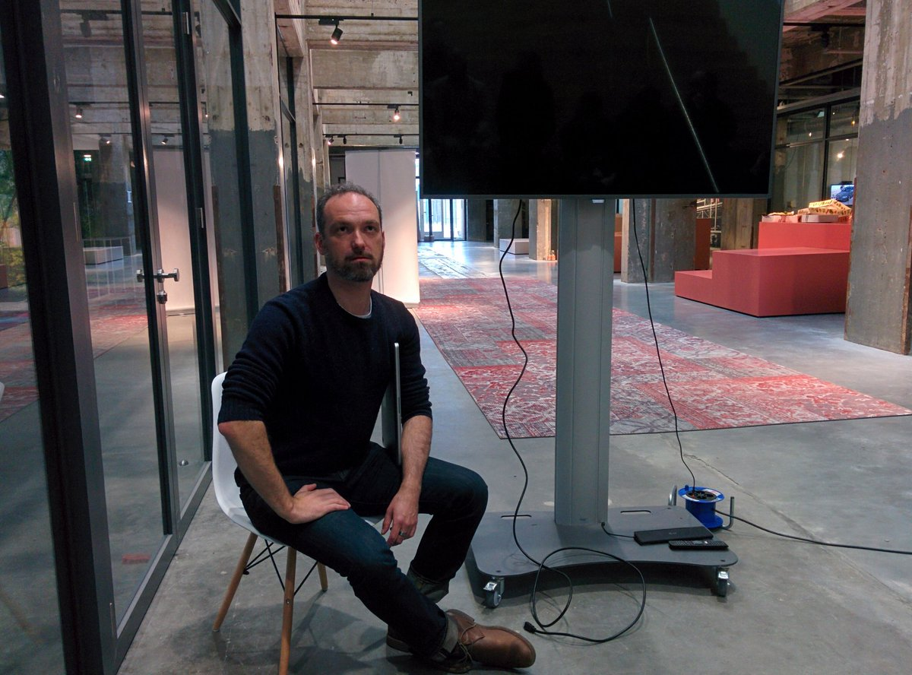

Reacticon March 2018 — a fantastic event full of great talks and discussions about React and Magento's future frontend.

Awesome talk by Shane O'Bourne, Peregrine on stage, and great Q&A sessions creating good discussions.

Day two was the hackathon, with James Zetlen joining and sharing with us.

