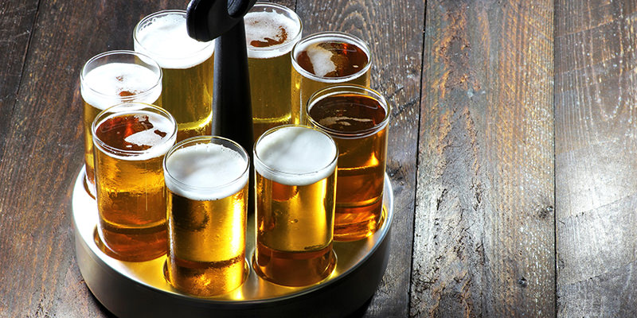
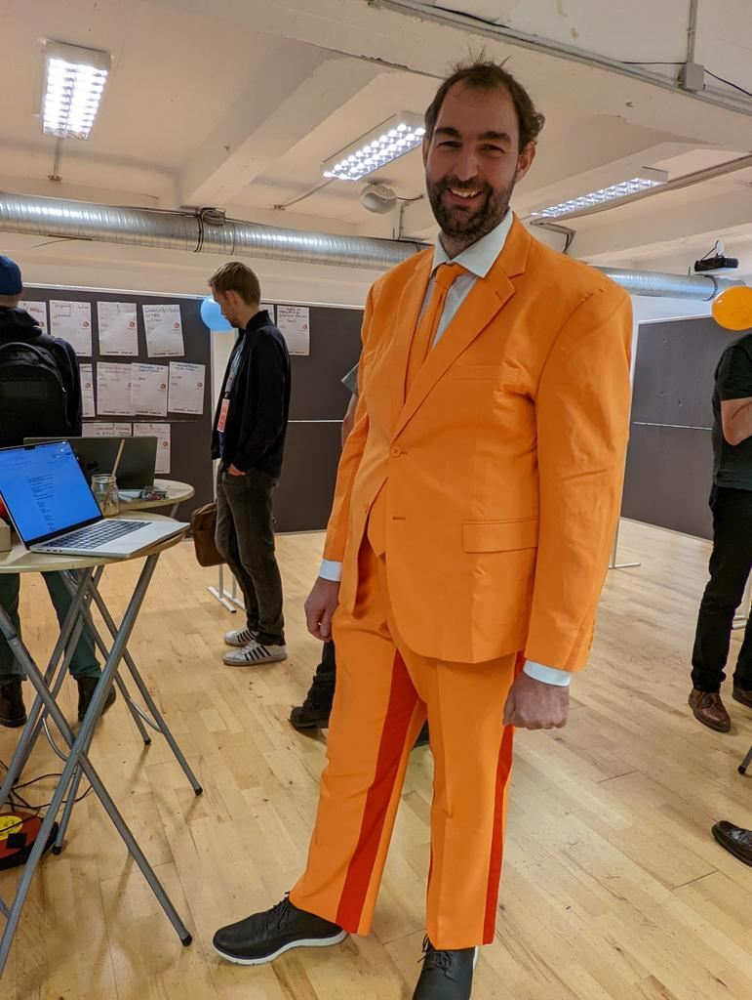
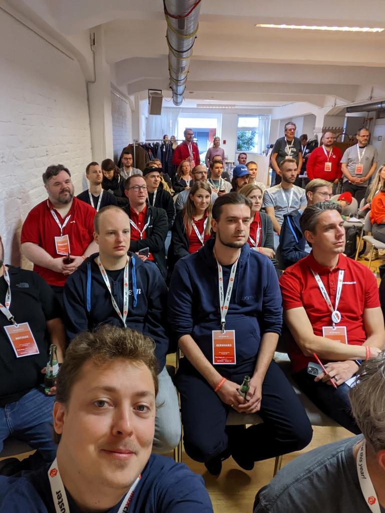
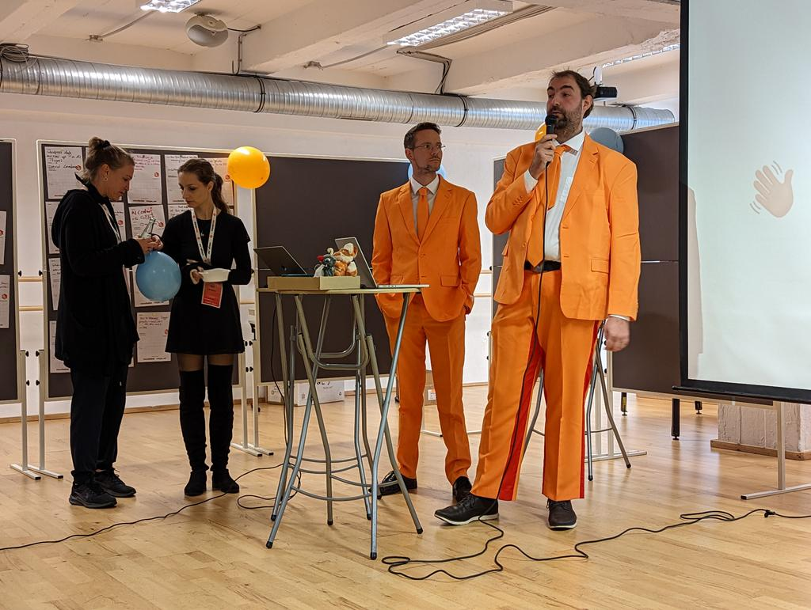
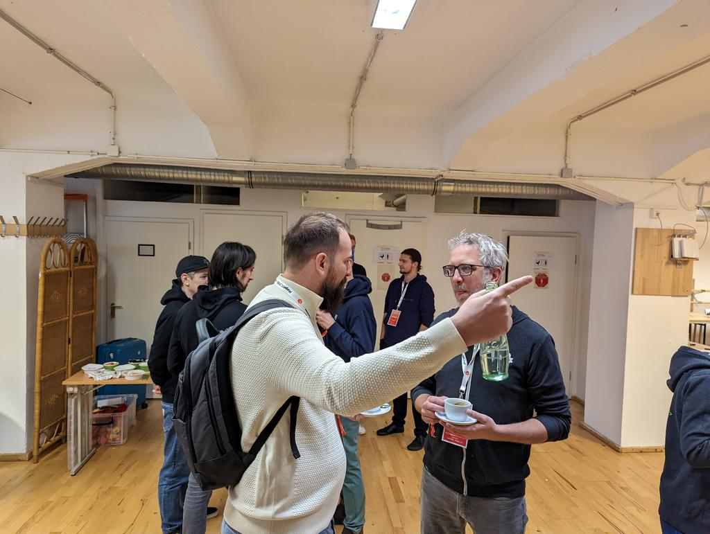
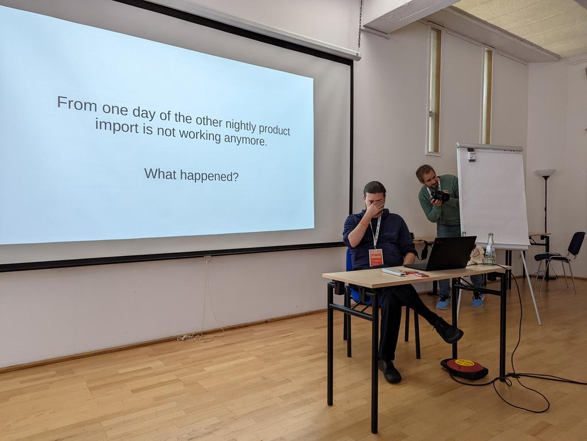
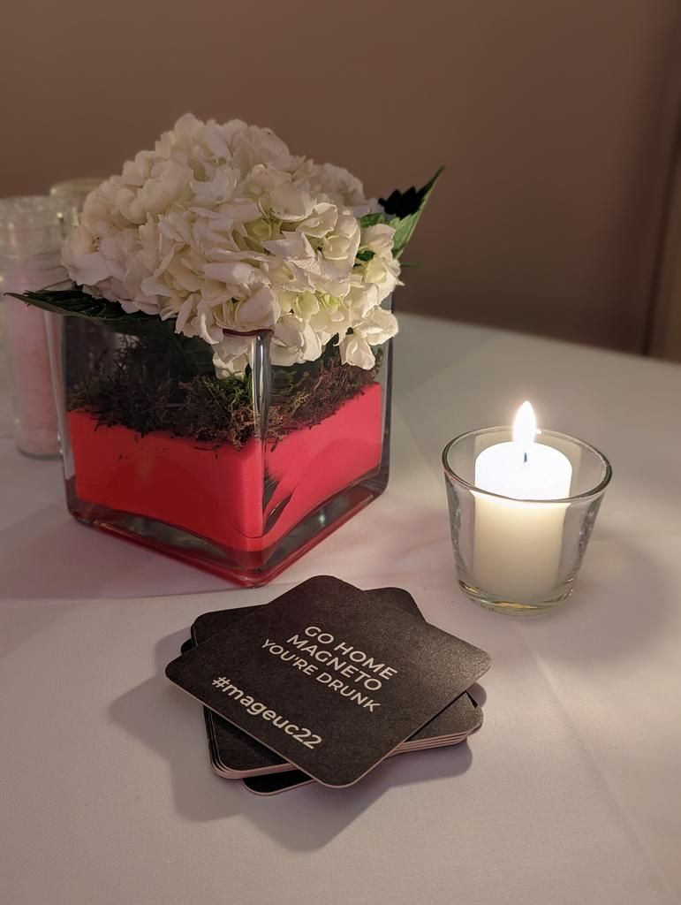
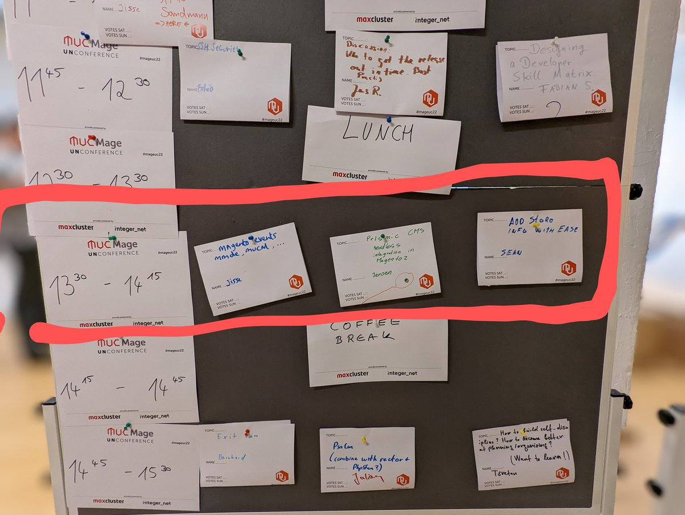
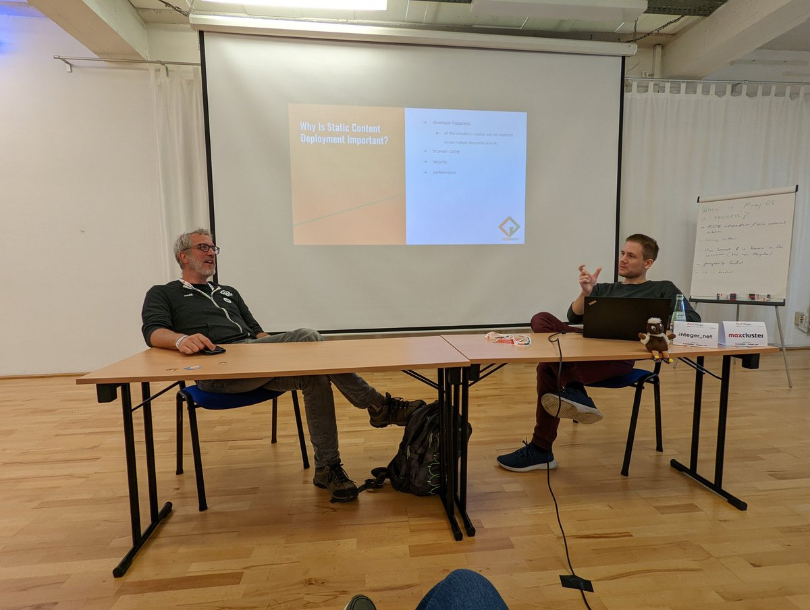
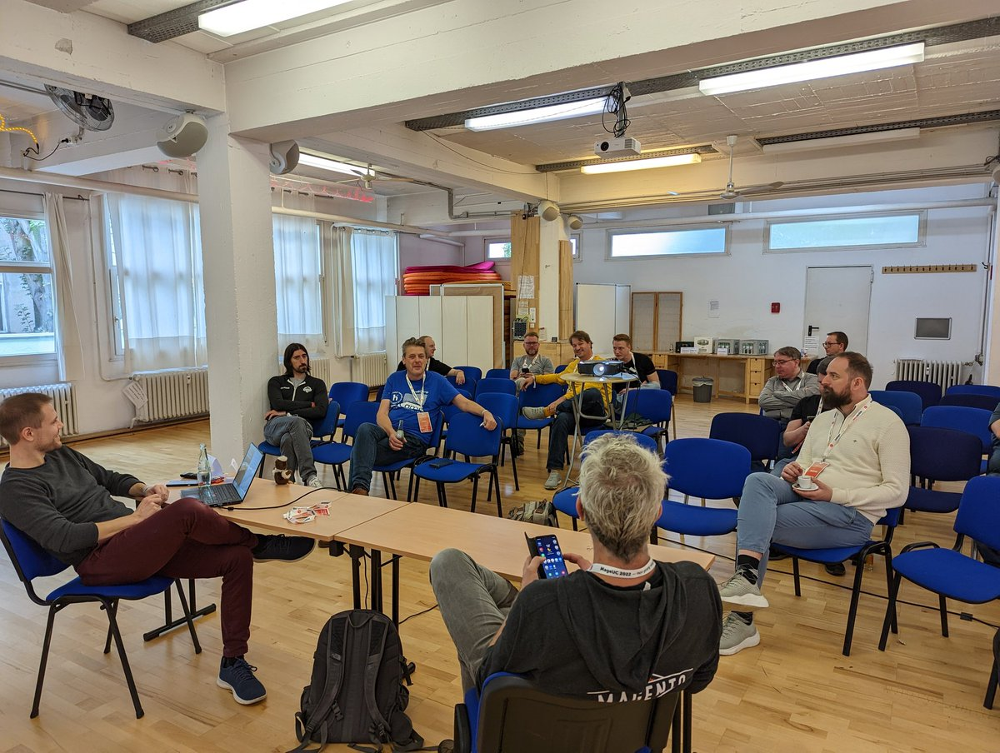

On my way with @allrude to MageUnconfrence.

Kölsch beer and Magento — what can go wrong 😁

Day 1 of #mageUC22 is starting orange 🟠

Solving Magento crimes at #mageUC22 🔍

Getting ready for dinner with Kölsch 🍺

The Dutch hour at #mageUC22 🇳🇱

Talking about static content in #Magento at #mageUC22

For anyone wanting to try out the Siteation StoreInfo:
- https://github.com/Siteation/magento2-module-storeinfo
- https://github.com/Siteation/magento2-module-storeinfo-extra
