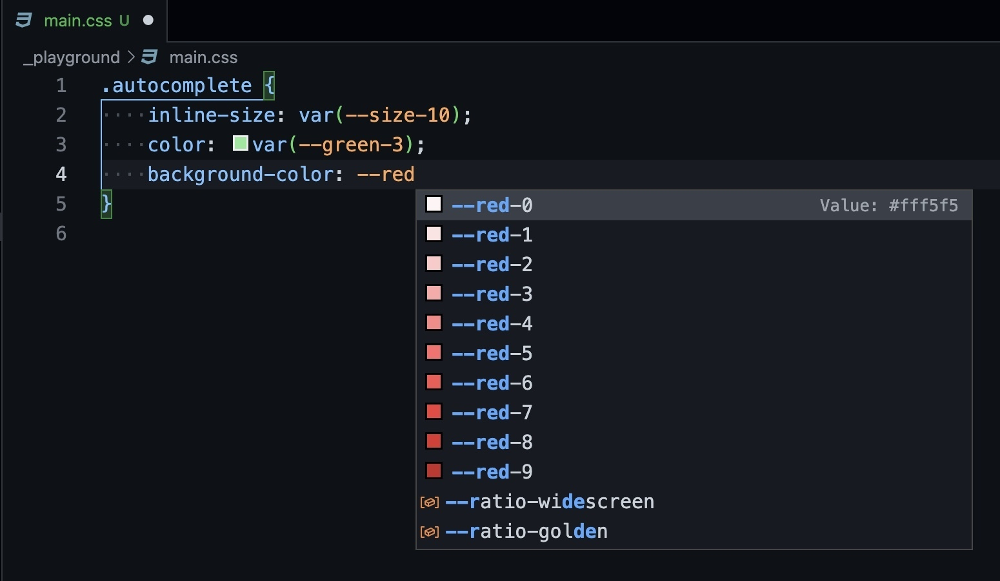
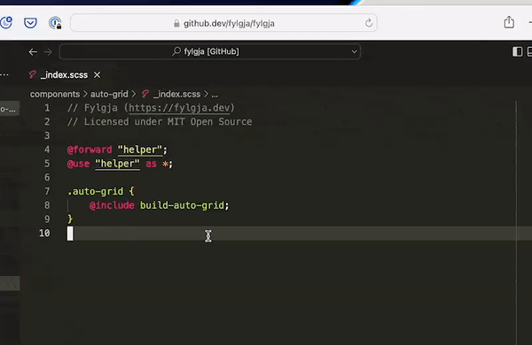

VSCode is a fantastic editor for writing in your favourite language, as well as a powerful tool for Javascript-based applications, introducing numerous functionality without the need for extensions.

How would you receive a similar experience if you were using a different language, like CSS?

In this article, I'd want to give two suggestions for enhancing your CSS game by incorporating CSS IntelliSense to VScode.

Before we get started, let's briefly go over a few things.

For formatting your CSS, I will always advise [Prettier](https://prettier.io/), due to the fact that it excels at what it does.

For linting your CSS, I. would advice to check out [Stylelint](https://stylelint.io/); you can also use it as a [VSCode plugin](https://marketplace.visualstudio.com/items?itemName=stylelint.vscode-stylelint).

## CSS Variable autocompletion

Now the first on on the list, of VSCode functions to add,
is adding support for CSS Variables.

Let's imagine you want to use CSS variables, but you don't want to have to go to the CSS tokens as a reference, what is available to you.

You can just type to see what is accessible.

For this you can add the VSCode extension [phoenisx.cssvar](https://marketplace.visualstudio.com/items?itemName=phoenisx.cssvar)

> The [Open Props Docs](https://open-props.style/) and [Fylgja Guides](https://fylgja.dev/guides/autocomplete/#css-variable-autocompletion-(vscode)) both discuss this extension and how to utilize it with these CSS frameworks.

So, what exactly does it do?

When you start typing in a CSS variable, this VSCode plugin will add autocompletion.

This greatly simplifies the process of locating and utilizing what is available in your project.

If you're interested, check out the [VSCode Marketplace page](https://marketplace.visualstudio.com/items?itemName=phoenisx.cssvar).

## SCSS IntelliSense

So the following one is for SCSS enthusiasts.

So there is a little more to support to add with SCSS, and this extension will make it a lot easier to utilize SCSS mixins, functions, and variables by providing autocompletion and IntelliSense to VSCode.

It also supports SassDoc, which means that hovering over SCSS mixins and functions will display the description and props, similar to JDoc and Typescript.

This VSCode extension is also very useful when working with third-party code, such as SCSS NPM packages.

Without reading the documentation, you can quickly see what the third-party NPM package provides.

> Thx [@SomewhatDev](https://twitter.com/SomewhatDev/status/1556698456424681473) for the showing Fylgja's SassDoc in action 😊

If you're interested, check out the [VSCode Marketplace page](https://marketplace.visualstudio.com/items?itemName=SomewhatStationery.some-sass).

## More?

Aside from that, there are certainly other great CSS IntelliSense and autocompletion alternatives; if you know of any, please share them in the comments.
and thank you for reading.
