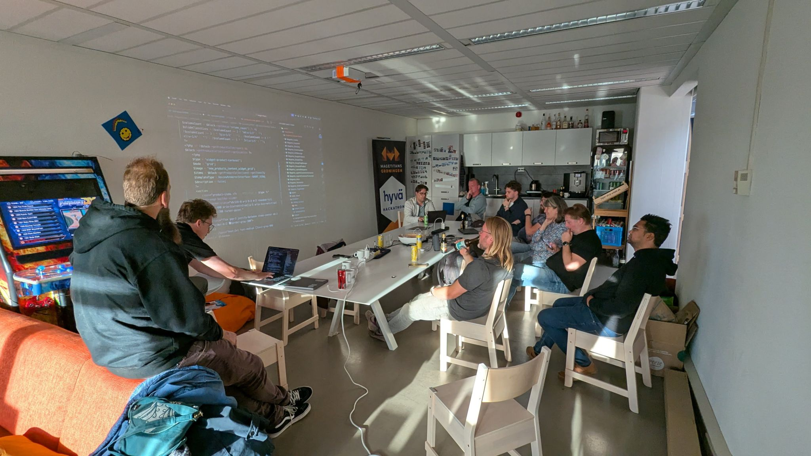
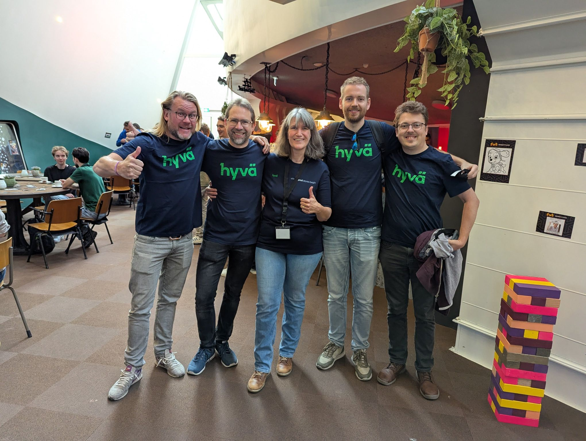
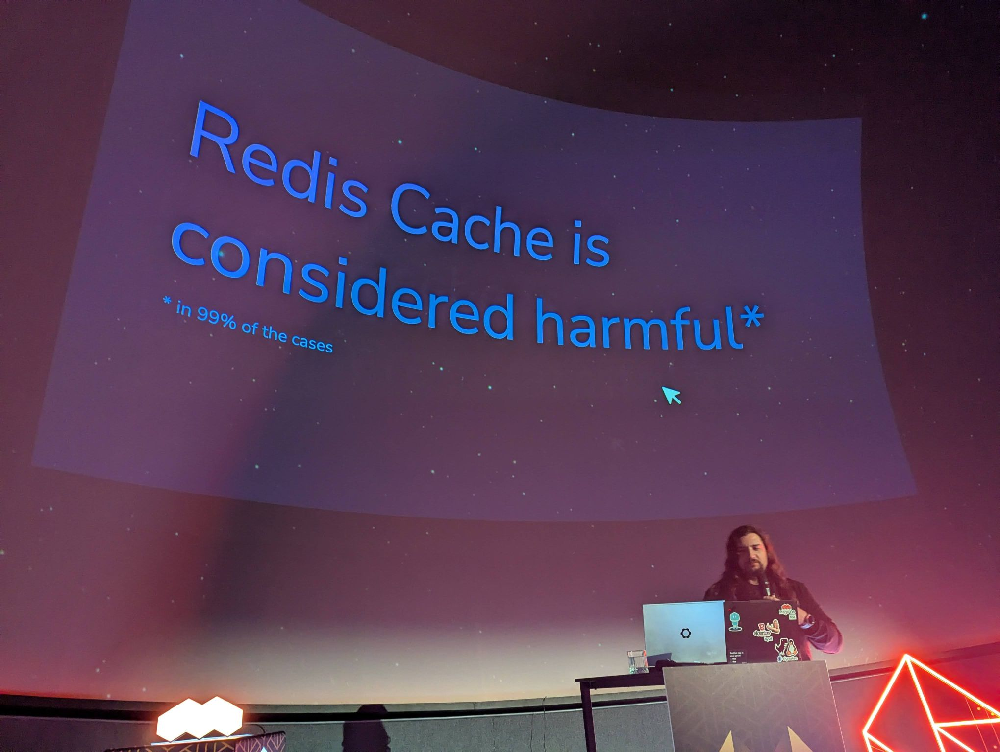
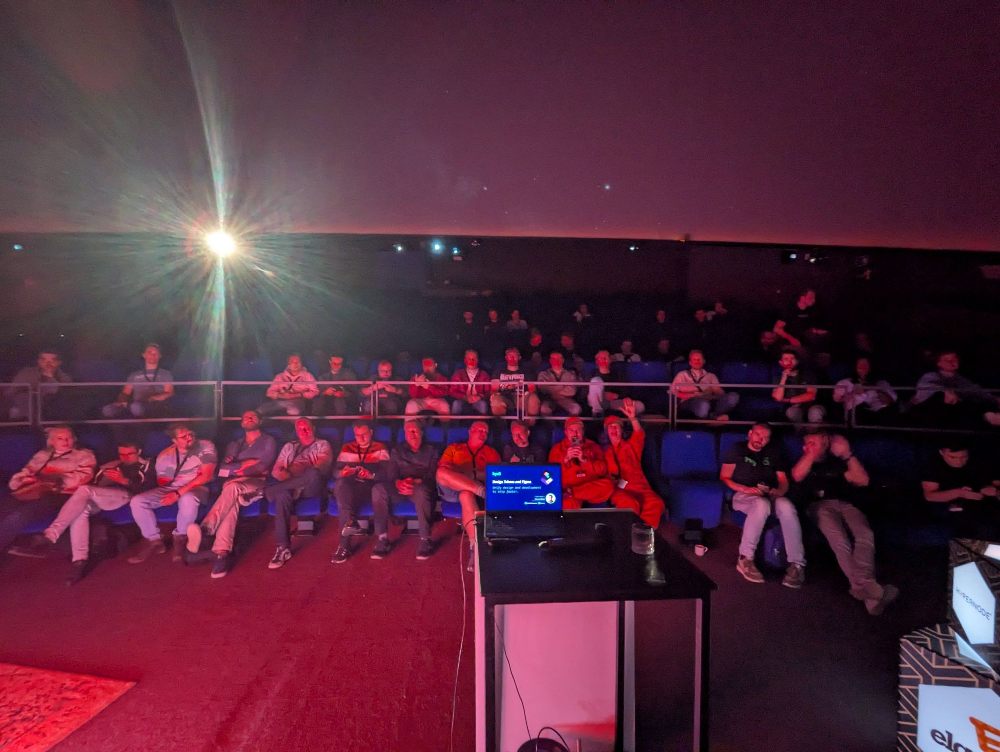
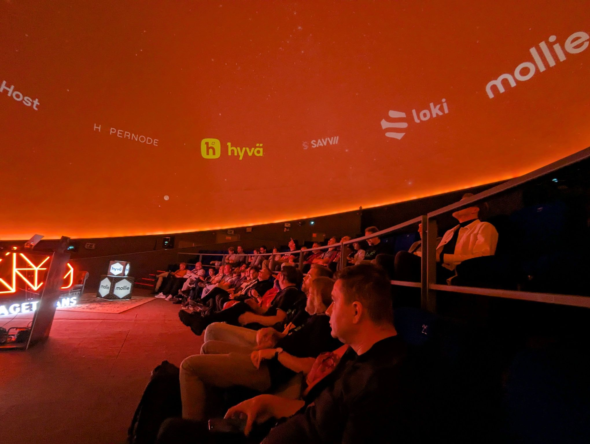
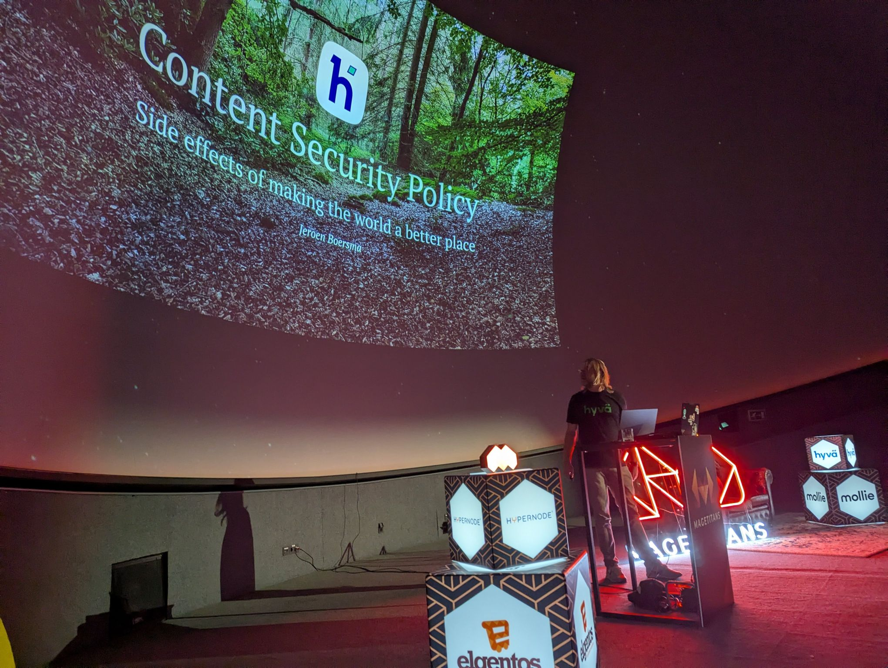
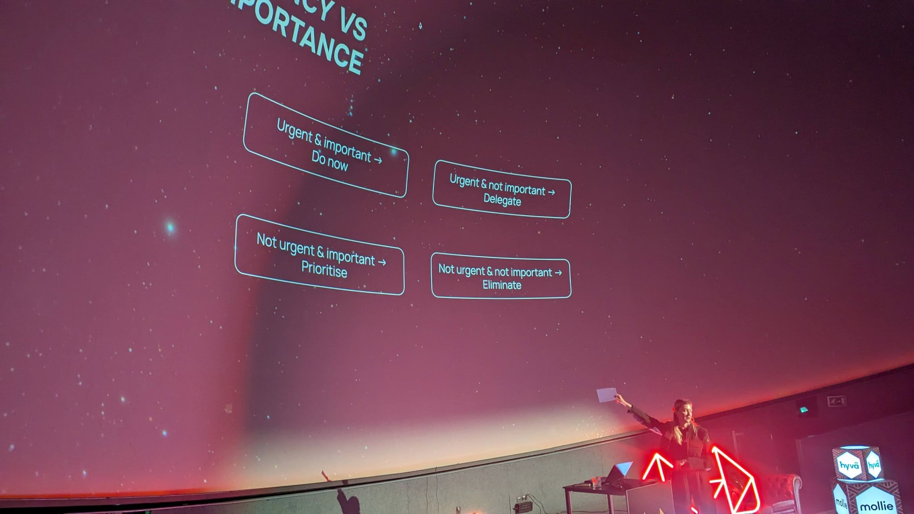
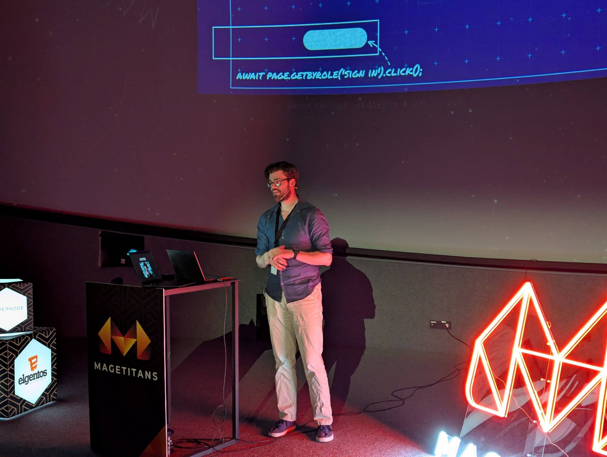
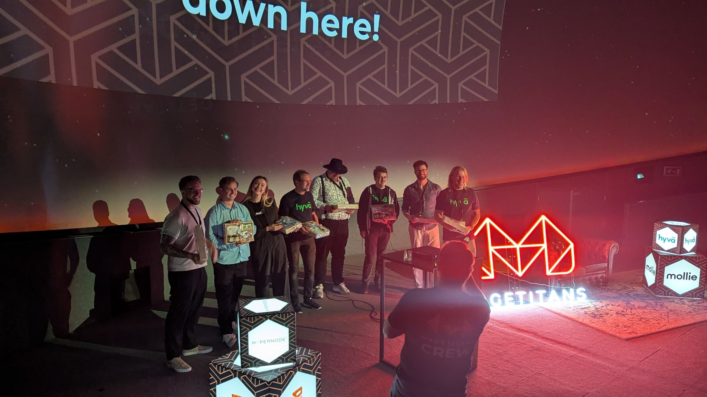

What an incredible two days at MageTitans Groningen! 🚀 Feeling completely energized and inspired by the Magento community.

The absolute highlight for me was stepping onto the stage to give my talk on what Design Tokens are and how they can be used with Hyvä and Figma. It was an amazing experience to share my knowledge with such an engaged audience.

The energy started early at Thursday's Hyvä Hackathon. I was thrilled to contribute the new Snap Slider integration for an upcoming Hyvä Theme release – a definite win! It was also inspiring to see demos like the AI Category Filtering from Jerke Combee and the Magewire-powered Email Correction from Isolde van Oosterhout - Huitzing and Vinod Sowdagar.

Beyond the code and the talks, the best part was reconnecting with so many brilliant people. The conversations about Magento, the impact of AI, and the evolution of Hyvä were fantastic.

A massive thank you to the organizers, sponsors, and fellow speakers for making this event possible. The passion in this community is unmatched!

## Hackton

## Mage Titans

