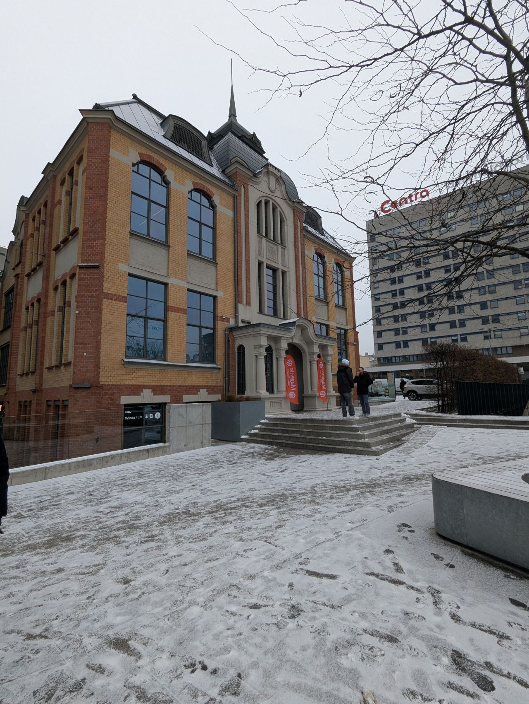
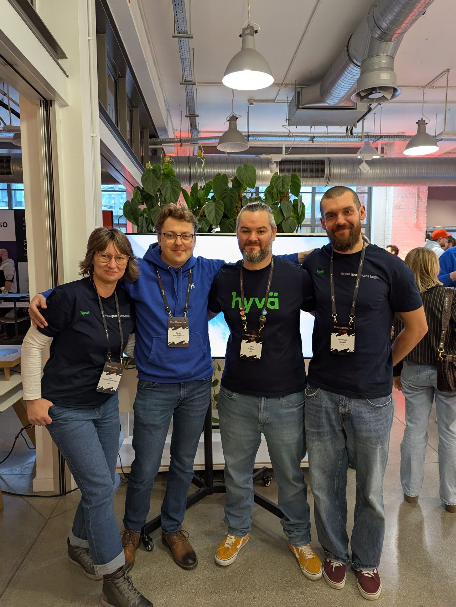
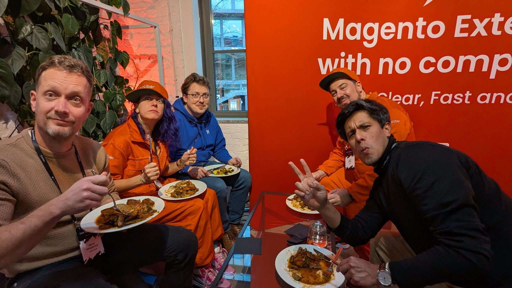
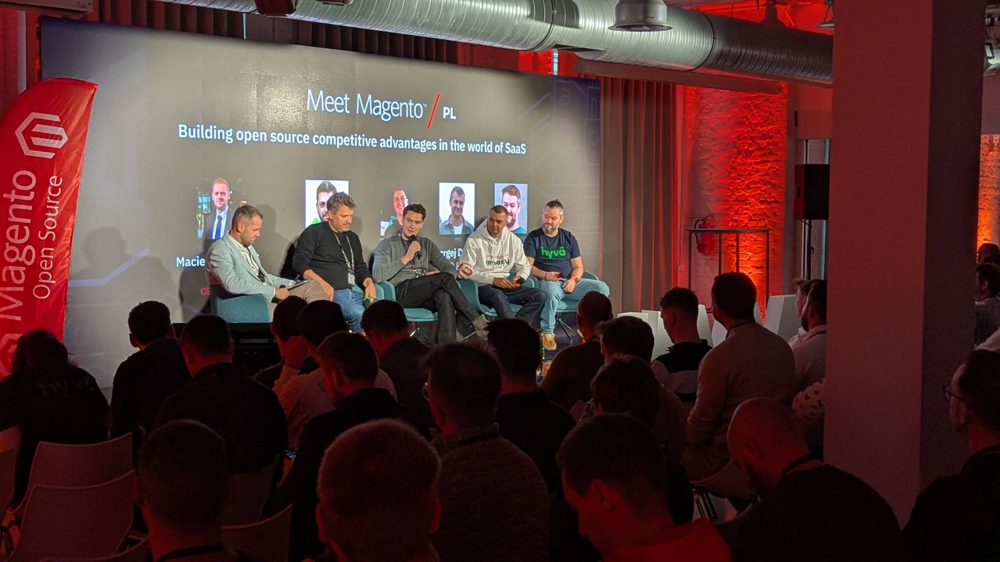
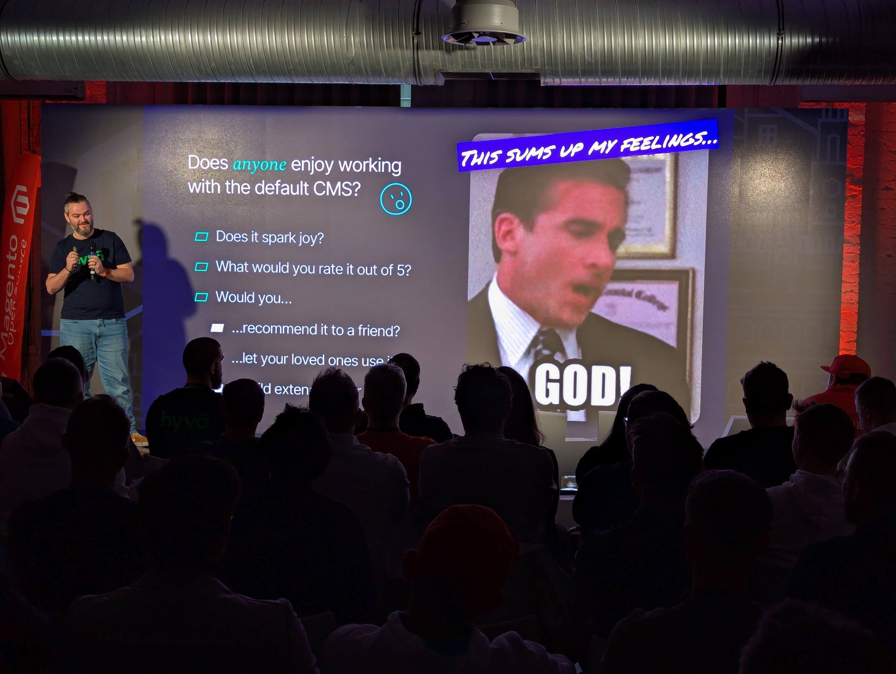
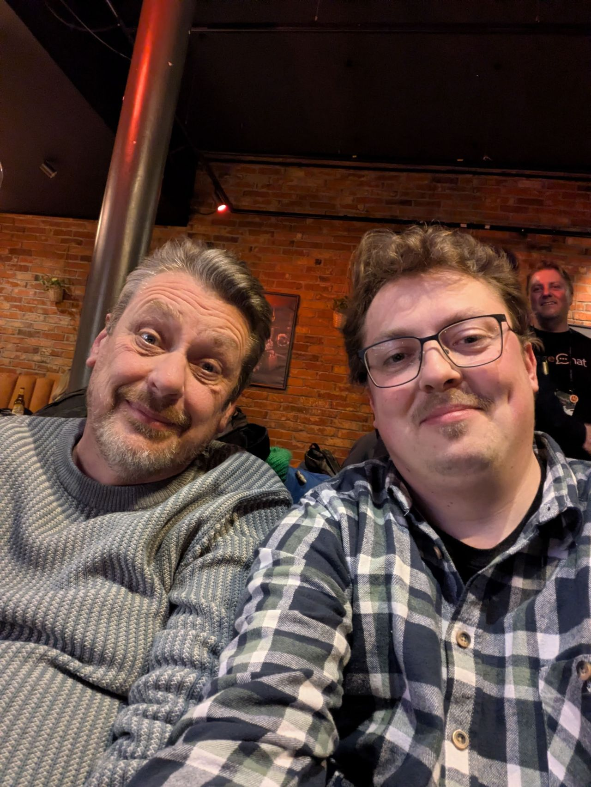

What a blast! Meet Magento Poland was an incredible experience and a journey of firsts for me:

- My first time driving so far for an event.
- My first visit to Poland.
- My first time attending Meet Magento Poland.

The event was packed, and it was great to connect with so many familiar and new faces. I had many great conversations and thoroughly enjoyed the talks, especially the latest version of John Hughes CMS therapy session, complete with fresh memes! 😁

A huge shout-out to the organizers at Meet Commerce, Snowdog, and qoliber for putting together such a fantastic event.

And a special thank you to Jakub Winkler and Aleksandra „Ola” Czapiewska for the warm welcome and for convincing me to come. I'm so glad I did!

