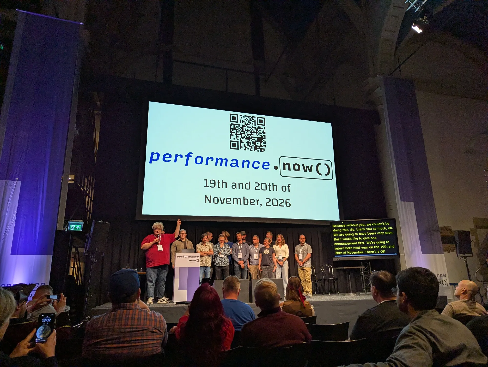
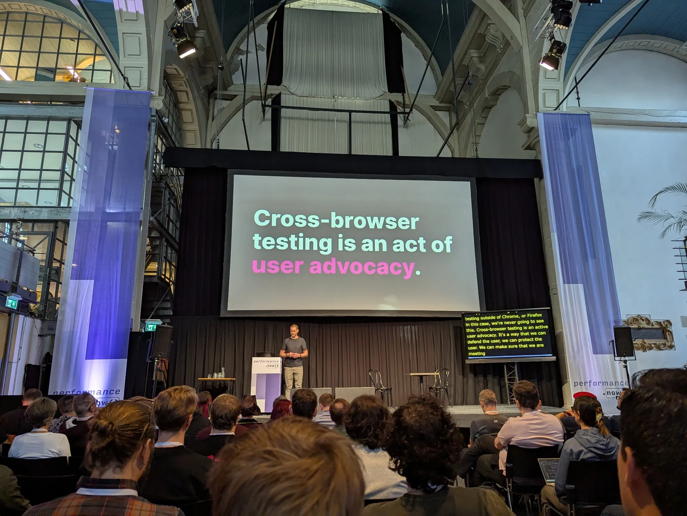
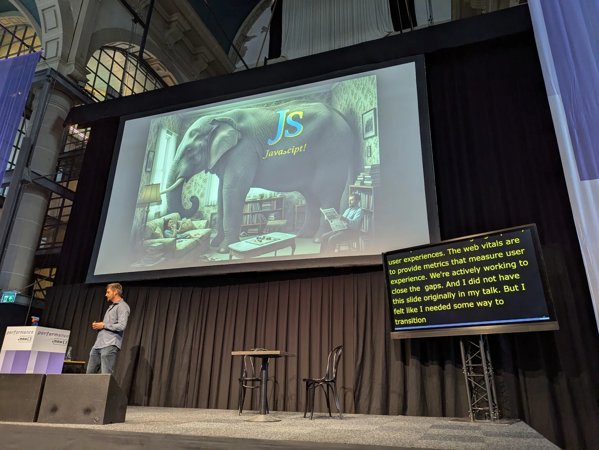
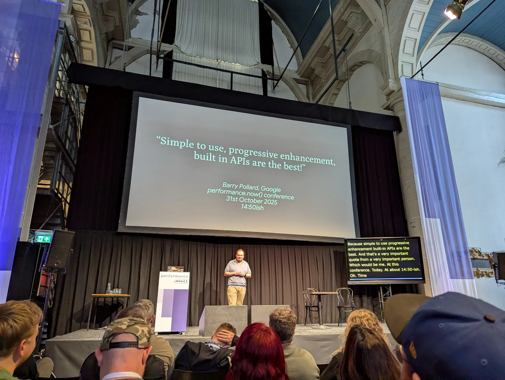

What a fantastic two days at performance.now()! Learned so much, not just from the talks, but from all the great people.

Time to digest those notes 😅! It was a blast being the Magento Dev in the crowd, explaining Hyvä to folks who hadn't heard of it yet 😁

