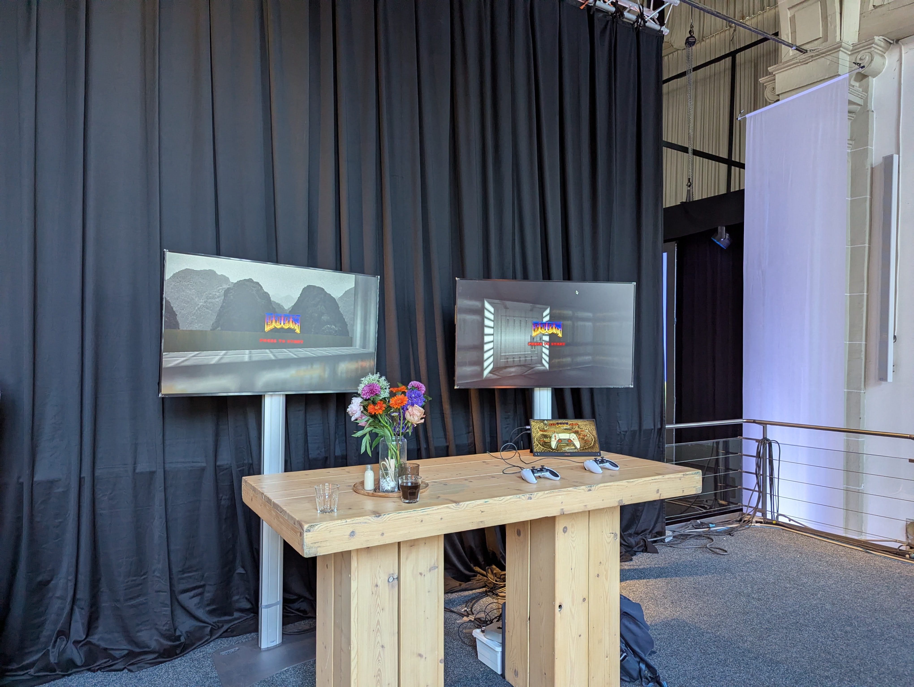
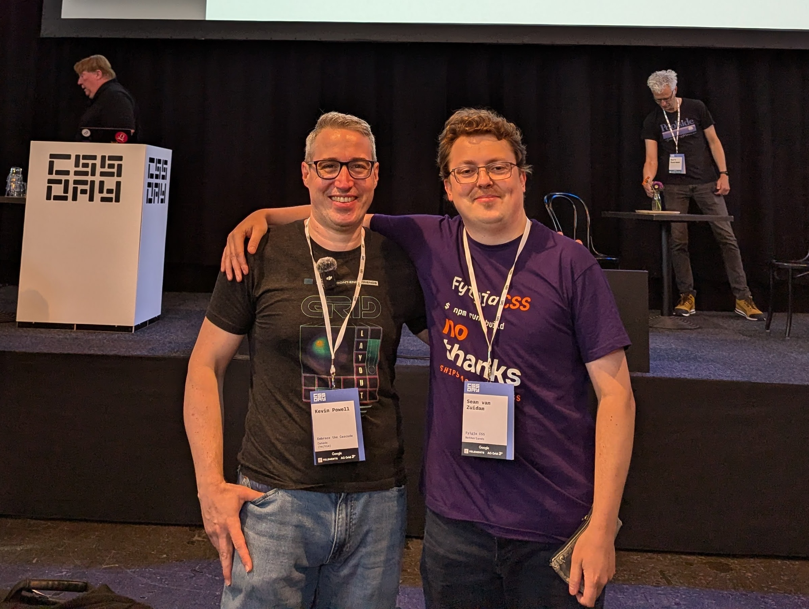
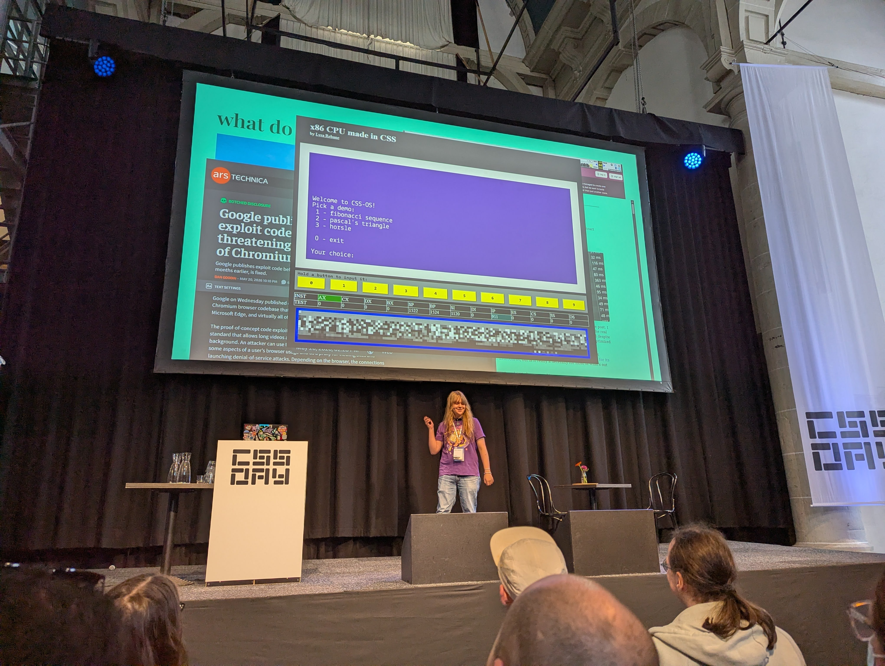
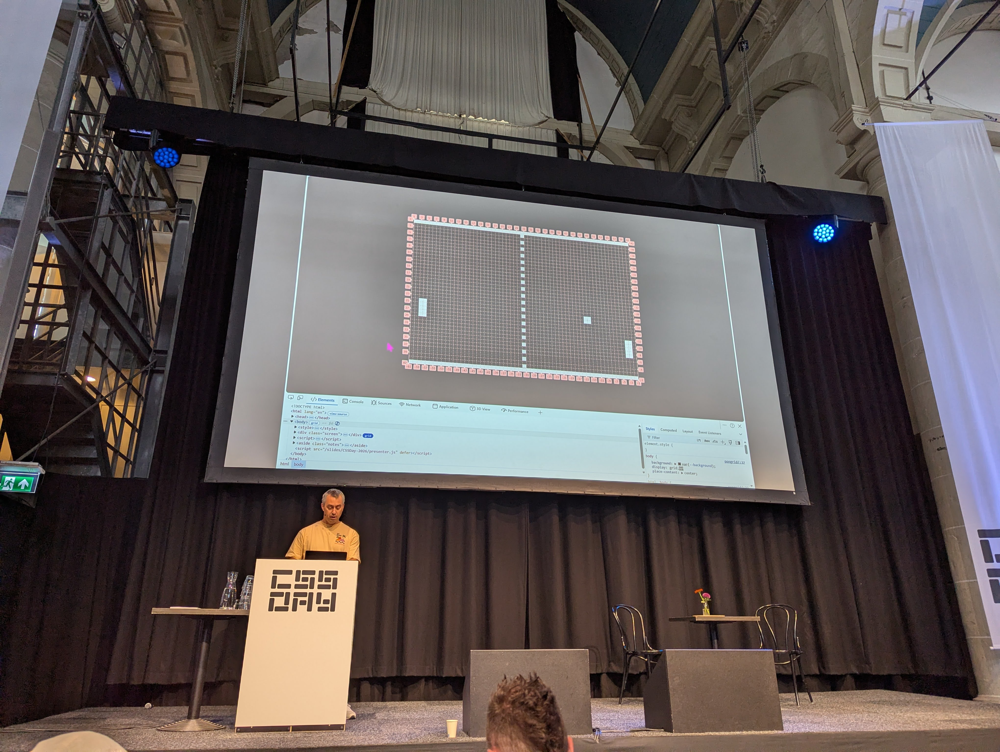
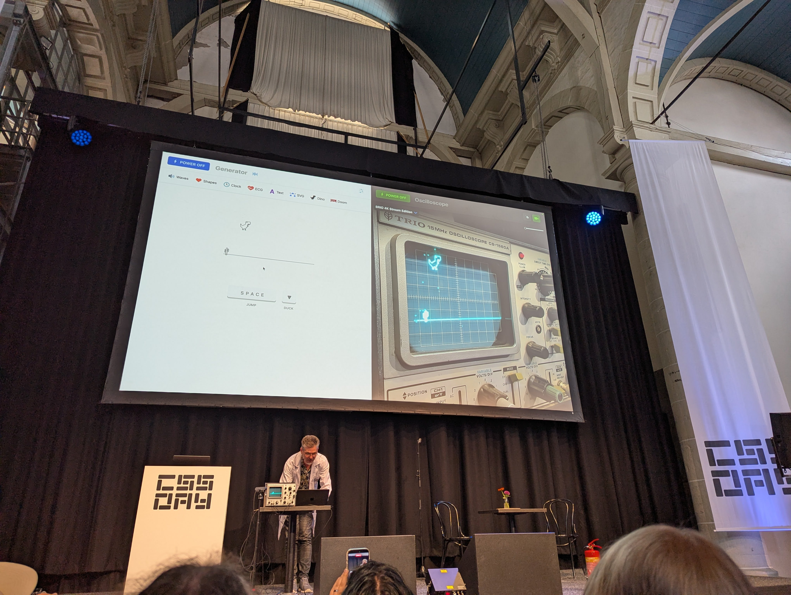
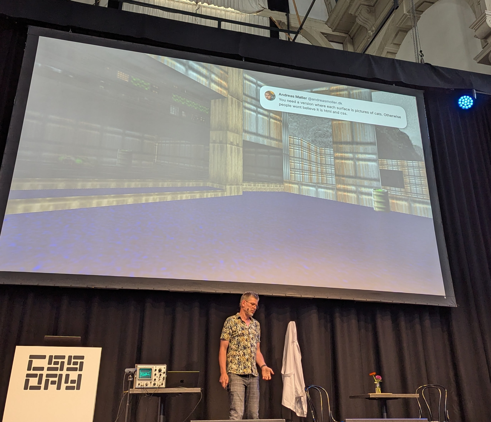
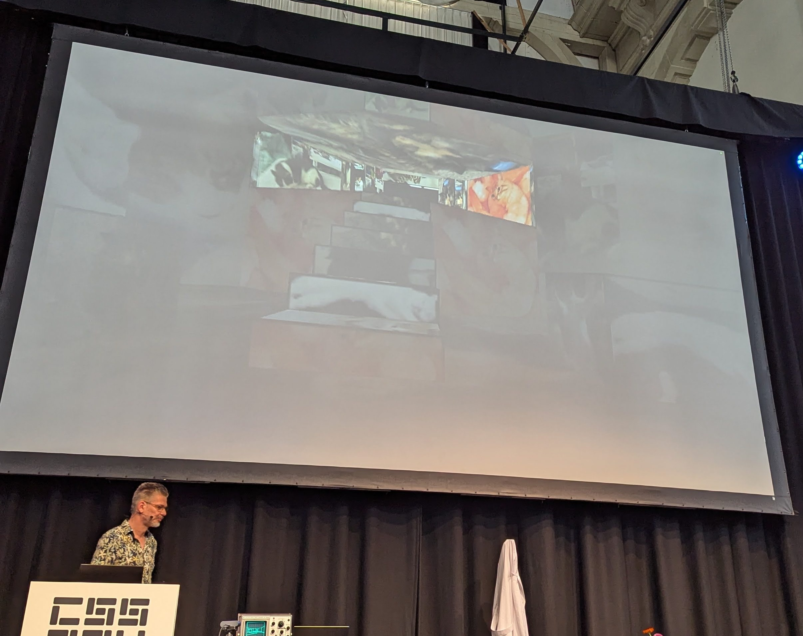
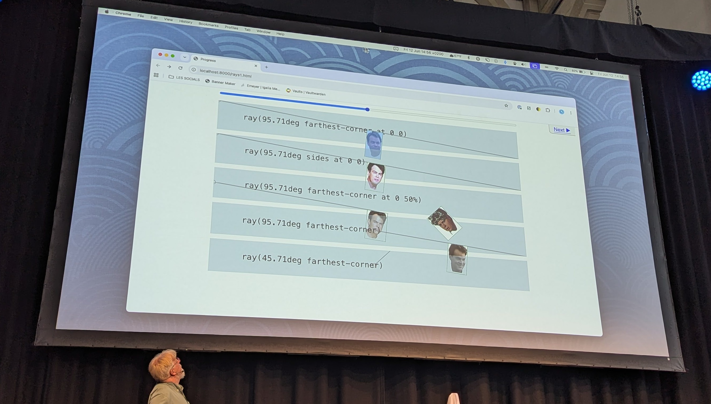
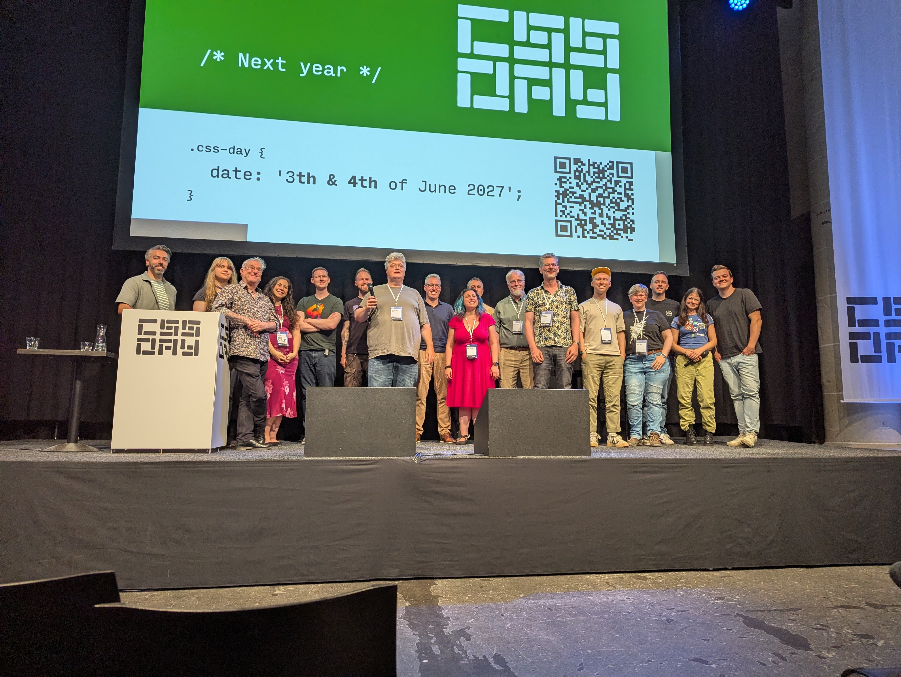

This year I finally stopped hesitating and bought a ticket for CSS Day. It's not the cheapest event to attend, but this year's lineup was too good to pass up.

> And spoiler alert, that was confirmed and more 🤩

## Day 1

My day started very early, on the train to Amsterdam with no headset 😢, but I was full of energy and buzzing to finally meet some of my CSS heroes.

I arrived early enough to wait a few minutes at the door, but the moment I got in and grabbed a coffee, I spotted the CSS Doom stand.

I'd played [CSS Doom](http://cssdoom.wtf/) before, but never with a PS5 controller. I was keen to try, but running into an old friend meant it would have to wait.

After catching up, I decided to shake some hands and fawn over a few of my heroes.

Just before the talks started I spotted Kevin Powell and had a chat with him and his wife, not even about code but about cities here in the Netherlands, including Zwolle.

I was about to grab my seat and snap a photo, but his wife spotted me first and offered a selfie instead, which of course I was happy to take.

_Many thanks to Kevin's wife for suggesting and taking the picture._

The day kicked off with Bruce Lawson as MC, who had a blast announcing the speakers and answering our questions, which we could send in via Bluesky.

First up was [Lea Verou](https://lea.verou.me/), who spoke about colors and her frustration that we still can't do a proper gamut. She explained how colors work and how browsers currently clip them, giving inaccurate values.

Funnily enough, I'd experienced this exact issue when building the hue-based colors for Fylgja CSS v2, without really understanding why. Great context to finally have.

I won't mention every break individually, but as I always say: events are not just about the sessions, they're also about the people, and I had some great conversations scattered throughout the two days.

Back to the sessions, Josh Tumath shared about OS-based text sizing and how it can impact your sites. I'd heard of the new tag but never dug into it, so it was good to finally get the full picture.

Right after, Jelle Raaijmakers gave his talk 'The value pipeline', a deep dive into how complex it really is to build a browser, and all the complexity we take for granted every time we write CSS. What browser vendors have to implement so we can build cool stuff is no small thing.

After lunch, Lyra Rebane blew my mind. She showed us how to build an x86 CPU that runs C code using CSS. Truly mind-boggling, and if anyone still says CSS is not a programming language, they're wrong. See it in action at https://lyra.horse/x86css/

Sara Joy followed with a talk on color scheming and how it matters to your users, it's not just an aesthetic choice but also an accessibility feature. She showed how CSS functions like `light-dark()` and `color-contrast()` can make implementing this a lot easier.

After the break, Bramus Van Damme showed the true power of View Transitions, not just for page navigation but triggered by a click or even scrolling. Small additions that can make a site feel a lot more interactive.

We closed Day 1 with Jake Archibald going deep on the Customisable `<select>`, the full journey from when it was first proposed to where it is today, and everything it took to get there: Popover, Anchor Positioning, the works. One thing that stuck with me: you can use Anchor Positioning without giving it a name, as long as you're using the Popover API. Had no idea.

After that I had a few good talks and beers, and checked out Kilian Valkhof's demo of [Polypane](https://polypane.app/). It's packed with so many more tools since the early days, and I even found a bug in [Fylgja CSS](https://fylgja.dev) in the process, so that's now fixed 😅

Then off for ramen, had to hurry a bit since I'd spent too much time talking and drinking, nearly missed closing time, but I made it in as the last customer at RAMEN-ISM. Worth it 😊.

## Day 2

Day 2 was a more relaxed start, the hotel was only a few minutes' walk away, so the doors were already open by the time I arrived. Ana Rodrigues had taken over as MC and did a great job introducing the speakers.

We kicked off with Kevin Powell's talk 'CSS is eating JavaScript'. He made the case that CSS isn't stealing from JavaScript, it's just finally getting the tools it should have always had. His weather app example drove this home nicely, showing off `attr()`, style queries, and `if()`.

During the break I finally got my chance to try CSS Doom with a PS5 controller, and it did not disappoint. Only got hit once, so I'll take that as a win.

With that out of my system, it was back to the talks, Patrick Brosset from the Edge team explained grid lanes and how they work, complete with a trippy example pushing Safari to its limits with as many lanes as possible, and even a few game demos like Pac-Man and Pong.

Manuel Matuzović opened his talk with a few alternative titles and the reminder that mental health matters more than productivity. From there he explored CSS Resets, do they still make sense? One thing I appreciated was his suggestion to use inline styles when it's just a CSS variable. He walked through his own UI defaults (deliberately not calling them a reset), and ended by showing his classless CSS framework [oli.css](https://olicss.com/).

Niels Leenheer gave what was, for me, the best talk of the event. It started with his passion for lasers, he built a clock using SVG and displayed it on his oscilloscope with math, which mercifully did not catch fire like in his previous experiments, in his garden. Then he took it a step further: Asteroids and the Chrome Dino on the oscilloscope.

And then, almost casually, Doom's E1M1 on the oscilloscope.

He then explained how he made Doom in CSS. Not 100% CSS, but all the parts CSS can handle are there. CSS Doom is a big list of divs built by JS reading the original game data, each div gets CSS variables for its piece of the game, and CSS logic does the rest to render the level.

And he showed a version with cats as the level backgrounds 😆

He also pointed out that the exit button in the level is an actual `<button>` element. If it works in CSS Doom, what's our excuse for not using one.

He ended the talk, fittingly, with an actual laser. Same demos as the oscilloscope, just on a laser beam. Awesome, though it hits a wall when shapes get more complex, like the Doom E1M1 level.

> If you've never played CSS Doom, give it a try at http://cssdoom.wtf/.

Eric Meyer followed with `offset-path` and the surprisingly wide range of things you can use it for, illustrated with a lot of rays.

To close the day we had two more talks from two people who've made a lot of videos together: Una Kravets and Adam Argyle.

Una kicked off with 'Modern UI Patterns', showing how modern CSS like `scroll-state` can progressively enhance pages, and used the web version of Google Photos eating 40% of the screen as an example of what not to do. A well-placed `scroll-state` could fix exactly that.

She also covered tooltip UX, the new popover hint, how to style it with Anchor Positioning, and a good mobile UX question: should the info icon appear after content by default, or be opt-in? I'm with her: opt-in.

If you're interested, here's the issue Una shared in her slides: [w3c csswg-drafts #13980](https://github.com/w3c/csswg-drafts/issues/13980)

Adam Argyle closed the day making the case for better CSS patterns, like logical properties, smarter media queries, and design tokens (but not too many colors). He showed [Open Props v2](https://opv2-beta.netlify.app/color/) and its new color token system, which looked very familiar as I have something similar in [Fylgja CSS](https://fylgja.dev/library/tokens/#colors) for a while now 😁

There was a lot more, but the through-line was clear: CSS components should be aware of their surroundings and react to the environment around them.

He wrapped up with a new JS library that bridges the gap, adding CSS variables for things CSS can't (yet) do on its own, like tracking where the cursor is. Definitely going to try [Prop for That](https://prop-for-that.netlify.app/).

Was CSS Day worth it? Absolutely. I'd have been gutted to miss it, great talks, great conversations, and plenty of inspiration I can already apply to my day-to-day work and to Fylgja CSS.

Will I go next year? Not sure yet, but if you've never been, I'd absolutely recommend going at least once.
