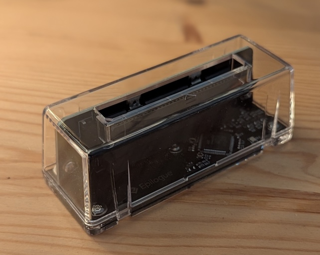
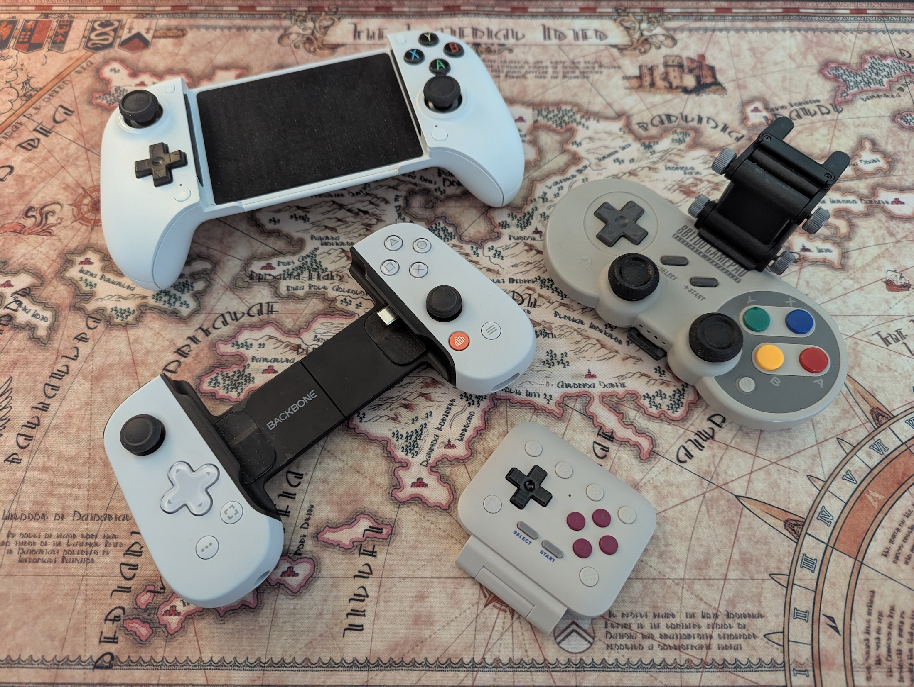
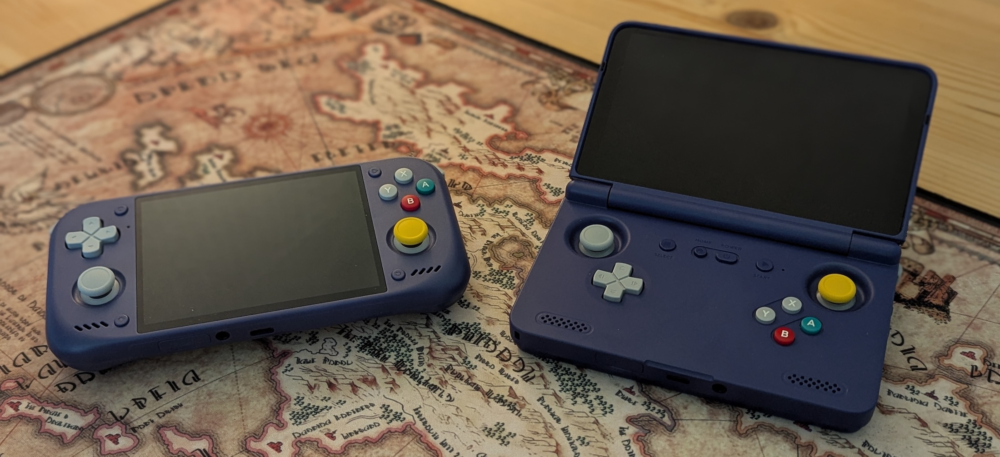

I love older games, and the Game Boy Advance and PSP are especially dear to me.
But replaying them has been quite a journey.

For those who don't know, you can play your games **legally** with a few solutions, including the GB Operator.
Of course the high seas are also an option, but I am not going into that topic.

{ width="380" class="mx-auto" }

But what device do you play on, and what emulators do you need?
Those were the questions I had, and here is what I have learned through the years.

The simplest solution is to use your phone with [Lemuroid](https://github.com/swordfish90/lemuroid).

It's super easy to install through the Play Store, and you don't need to know which BIOS files are required.

> I am not getting into iOS emulation. That's a different topic, and I am not an iOS user, so that's another reason.

Lemuroid does have its limits, though.
The update cycle is not great, and the save files are hard to reach if you want to move to another emulator.
It supports a lot of platforms, but the options to configure them are limited.

So this was the first thing I wanted to explore properly: how to run dedicated emulators for each platform and which frontend to use.

I still recommend Lemuroid to newcomers, but if you need more than just basic emulation, you should consider other options.

I am not going into how to set up each emulator, since that differs per emulator.
If you need help with that, check out [Retro Game Corps](https://retrogamecorps.com/) for their excellent articles on the topic.

The one topic worth mentioning is the BIOS files needed for PSX (PlayStation) and PS2 (PlayStation 2) emulation, as those were hard to get.

I had to search the web for them, but I am not going to add any links here, since they are technically copyrighted.
What I can say is that once you have them, you can reuse them for future emulation setups, so they are worth keeping.
I am not sure why this part is so difficult, or why the BIOS is not included in the PSX and PS2 emulator setup, when other systems and emulators do include it.

Besides that, it is not as difficult as it seems.
The emulators I have used are a bit complex in their UI, and sometimes the setup is not clear, so it's a learning process, but with some guides it gets easier.
The two exceptions are PPSSPP and Dolphin, which are super easy to use.

## My Devices

Devices are where it gets interesting. In short, I held off on getting one for years.
Funnily enough, my first dedicated retro device was the [Analogue Pocket, which I shared here before](../../2021/analogue-pocket-arrived/).
It is a fully native device that lets you play your real Game Boy cartridges on modern hardware.
I have had it since 2021, but my one gripe is that it's not that portable and not cheap, so it's not something you carry around all the time.

So my phone has been my go-to device for emulation on the go.
I have had many phone controller options, and I recently got one that is super portable, the 8BitDo FlipPad.

It's safe to say that if you don't mind the more limited platform options, or just need Game Boy gaming, the 8BitDo FlipPad or the Pocket Taco are great options.

Before I had the FlipPad, the other controllers weren't great. They worked perfectly, but they all had one issue: portability.
They were so bulky that I might as well get a dedicated device.
After exploring many options and watching a lot of videos from [Wulff Den](https://www.youtube.com/@WulffDen) and [ETA PRIME](https://www.youtube.com/@ETAPRIME), I decided to pick up the Retroid Pocket Flip 2.
It matched my requirements at the time and was powerful enough to play a few GameCube games, but it was rough around the edges.

The Flip 2 is super portable, so it was easy to just throw in my bag and carry around.
It has been my go-to option for a few years now.

For about a month now I have been using the Retroid Pocket Nova, and it is a great device.
It's a bit weird if you like modern games, since it has a 4:3 screen, but that's perfect for older games.
It is more powerful than the Flip 2 and plays GameCube and PS2 games with ease, making it a real powerhouse.
I have even played a few Steam games on it that work well with this device.

So it's safe to say a proper emulation device is a good pick, and I would definitely recommend it.

## Library UI

Having a library of games means you want to display it nicely.
This is the one topic I have not settled on yet, but I am super happy with [Beacon Launcher](https://play.google.com/store/apps/details?id=com.radikal.gamelauncher) at the moment.

So why do you need one, you might ask?

With many emulators, it gets annoying to jump to the right app every time I want to play a game.
The UI also differs per emulator, and some are not so nice to look at.

That is why there are many retro frontends out there, like [ES-DE Frontend](https://es-de.org/), [NEO Station](https://neostation.dev/), [Cannoli](https://cannoli.dev/) (successor to MinUI) and many more.

I picked Beacon Launcher because it is simple and easy to set up, without a lot of fluff around it, making it perfect for me.
I recently tried [Papaya](https://play.google.com/store/apps/details?id=com.sebschaef.papaya), which looked good but was not a match for me, since it is limited in a few areas and does not work with GameNative.

My only wish for Beacon Launcher is support for different views per tab, or at least for the NOW and FAV tabs.
So who knows, that may change my mind in the future.

For now, I am going to focus on just playing on the Nova, and not tinkering too much with each emulator setup and the launcher.
