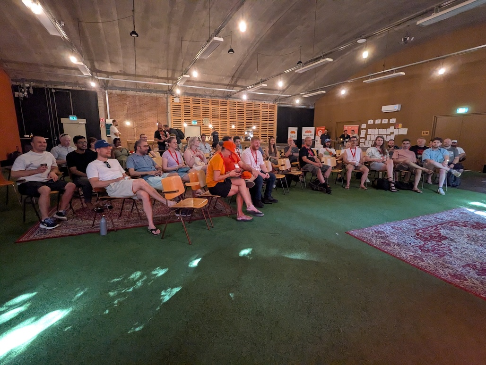
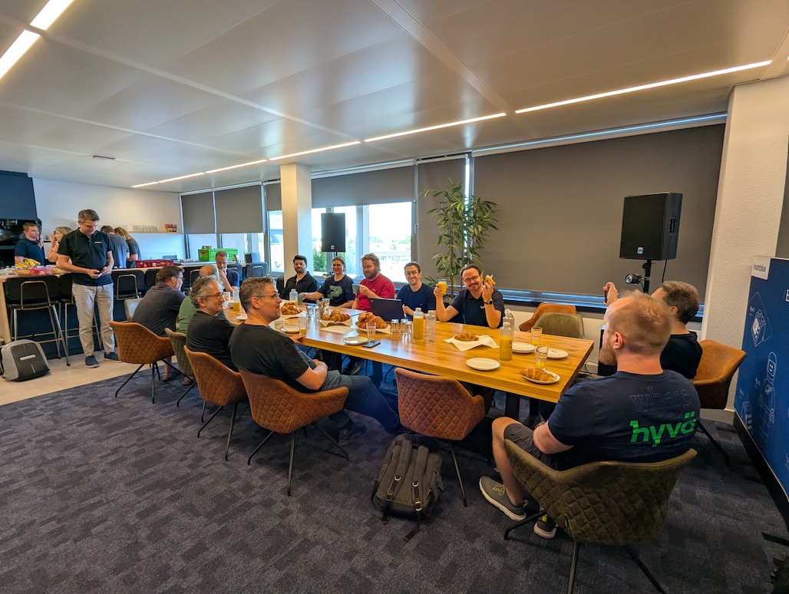

It has been a few weeks since my last post. I really wanted to write about the many things I did and learned, but sadly I did not find the time for it. In that time I attended the [Mage Unconference NL](https://mageunconference.nl/) and the [Hack-AI-Thon](https://www.hypernode.com/en/hack-ai-thon-2026/), organized by [Hyvä](https://www.hyva.io/), [Hypernode](https://www.hypernode.com/) and [Maxcluster](https://maxcluster.de/), and together with my colleagues, we released not one but multiple releases of the Hyvä Theme.

So a lot.

Now, instead of repeating what many others already shared on LinkedIn and elsewhere, I want to focus on one topic that, funny enough, came back into the spotlight.

I did a few talks about it through the years and even implemented this for one website before I joined Hyvä.

So it's not a topic unfamiliar to me, and it's something everyone should use in some form. Sadly, over the years, I only met a few people who actually used it.
But thanks to AI it made a comeback, and that was very noticeable this year, especially at the two events I attended.

I am talking about Design Tokens, if the title did not give it away 😏

Using AI to create a frontend is not something many are unfamiliar with, and while the results are far from perfect, one route is to not let AI create everything, but only parts.

Now at the Mage Unconference we had one talk about this where we explored how to export a design from Figma into code, using AI.

And if you know me, I have shared many times that I don't think AI can create a good frontend.
Sure, it can create something that works, but it will miss many things, like proper accessibility and proper responsiveness.

We explored it, and one topic that came up was: why not skip Figma and use [Claude Design] to create a proper design that Claude Code can convert into a good starting point for the site?
The nice part is that prototyping becomes so much easier to set up, since you have something that's not perfect, but for a client it's a good example of how a site can work.

That said, we did not solve the question, we only explored it.

This idea reignited my goal to explore another route: exporting those colors, spacing and font choices to design tokens.

I knew [Google Stitch] supports a `design.md` file that lists all the tokens it used, so I knew it was doable there.

I did not explore this further since after the Unconference we had a major Hyvä release of all our products, including the Theme and UI Library.

But I knew the Hack-AI-Thon was coming up, and it was the perfect topic for this AI based hackathon.
So I added the topic to the board, and three other participants joined, which was a good sign of how the interest in exploring this topic was growing.

At the Hack-AI-Thon we explored the two AI tools for building a design: Claude Design and Google Stitch.

Sadly, Claude Design had no default export file like Stitch.
But luckily, Claude Design was capable of creating a `design.tokens.json` file if asked.
It roughly followed the W3C standard, but that's okay, the [Fylgja Props Builder] can work with that, and you can prompt Claude to adjust the format.

So for the Hack-AI-Thon I first explored Claude Design, since we already had a W3C based parser for design tokens, which made it easier to add support for.

This worked great. I added two new options to [Hyvä Tokens] and the [Fylgja Props Builder]: one to handle the removal of the wrapper, and a rename function, so we can adjust the tokens at the code level. With the help of Claude that was added, and it even wrote the tests for me. Awesome!

Now, I picked up Google Stitch on day 2 of the Hack-AI-Thon, but actually started while we were stuck in a massive traffic jam. At the event itself I was too busy talking and exploring what everyone else was making.

Again, I was surprised how easily Claude made the new parser for Google Stitch, along with a small mini YAML parser.

I completed it over the weekend with proper testing, handling the many edge cases. Sadly, I was also disappointed that Google Stitch always forces itself to use Material Design 3 for the design token naming.

Sure, I could force it with a lot of prompting, but it was an annoying journey, and for Hyvä I needed a user friendly solution. The rename function I added for Claude Design solved some of it, but it requires documentation, which is far from perfect.

So for Hyvä I needed to create a fallback for the design tokens Hyvä uses, and this did the trick. Now, if `color-primary-lighter` is missing, it will use `color-primary` as the base value and use `color-mix()` to create a proper lighter color.

And so my journey with AI and Design Tokens is over.
Or is it? This week, together with [Vinai](https://vinaikopp.com/), I shipped the result of all this exploration: [Hyvä Theme 1.5.2, which includes these new updates](https://docs.hyva.io/hyva-themes/upgrading/upgrading-to-1-5-2.html). If you use AI for design, give it a try. And if you don't use Hyvä, you can still put it to work directly with the [Fylgja Props Builder].

[Fylgja Props Builder]: https://fylgja.dev/library/extensions/props-builder/
[Hyvä Tokens]: https://docs.hyva.io/hyva-themes/working-with-tailwindcss/using-hyva-modules/tokens.html
[Claude Design]: https://claude.ai/design
[Google Stitch]: https://stitch.google.com/
