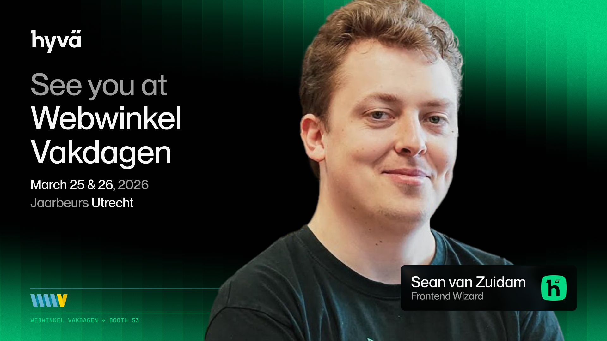

See you in Utrecht this Wednesday! 👋

I’m heading to Webwinkel Vakdagen on March 25th, and I’d love to see you there. 🇳🇱

This year, Hyvä is teaming up with co-host Hypernode and our partners to take a stand for Ownership 🚩. In a world of SaaS "success taxes," we believe your store should be an asset you own, not a liability you rent. 🌱

Find us at Stand 53 for a delicious coffee, freshly baked stroopwafels 🧇, or a cold beer 🍻. Whether you want to talk Open Source, frontend development, or just catch up, I'd love to see you there! ✨

👉 The vision behind the booth: https://hyva.io/blog/ownership-at-webwinkel-vakdagen-2026.html

